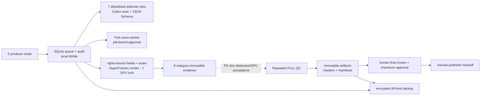

# Перенос Video Factory на сервер

Статус V2: проверяемый runbook миграции для пяти редакционных линий и целевой
нагрузки 10–15 вертикальных роликов в сутки. Он описывает конечную production-
топологию, но не объявляет незавершённые обработчики готовыми.

## Текущая готовность к cutover

| Контур | Состояние | Что это означает |
|---|---|---|
| Очередь, leases, heartbeat, DLQ, backup | READY | Можно переносить и запускать на одном writer-хосте |
| `research` → `editor` | READY | Семь schema-bound Codex-ролей запускаются headless |
| Fish Audio `voice` | READY | Job-bound approval, секрет вне очереди, не более двух генераций |
| Motivation `source_audio` | PARTIAL | Rights-bound handler, byte/hash gate и trusted runtime unit готовы; реальный acceptance job ещё нужен |
| Media discovery/freeze | PARTIAL | Pexels discovery и explicit freeze handlers/units готовы; live credential, rights-cleared media E2E и provider soak ещё не приняты |
| Licensed BGM / program mix | PARTIAL | Immutable WAV, license-receipt/human-approval SHA binding, deterministic ducking and loudness gate are implemented; a live rights-cleared asset and Linux FFmpeg acceptance job are still required |
| Shotlist → HyperFrames project → render | PARTIAL | Compiler, checksum-bound preview gate и render handler подключены; реальный NVENC/WebGL acceptance render ещё не принят |
| Semantic + technical QC | PARTIAL | Восемь checksum-bound analyzer reports, evidence gate, повторный FULL QC и trusted units готовы; реальные observer executables/GPU E2E ещё не приняты |
| Review outbox/publish | HUMAN ONLY | Timer создаёт только immutable `pending_human_review` bundle/event; `final_review` и публикация остаются действиями человека |

**Не переключайте production writer на сервер**, пока незакрытые acceptance-
условия строк `PARTIAL` не подтверждены реальным прогоном: утверждённая идея → media
hashes → звук → shotlist → 1080×1920 MP4 → QC → pending approval. До этого
сервер допустим для shadow-очереди, ресёрча, сценариев и controlled voice jobs.

## Что нужно предоставить владельцу системы

Обязательно:

- SSH-доступ к чистому Ubuntu 24.04 LTS хосту с `sudo`, статическим публичным IP
  или VPN-доступом;
- выбранный сервер минимум 16 vCPU, 32 ГБ RAM, 1 ТБ NVMe и NVIDIA 12+ ГБ VRAM;
- новый Fish Audio API key вместо опубликованного в переписке, Fish
  `reference_id` и документированное право коммерческого использования голоса;
- отдельный OpenAI Platform project/API budget для production либо заранее
  проверенный headless device login; подписка ChatGPT Pro сама по себе не
  является гарантированным API-бюджетом;
- перечень аккаунтов/регионов публикации и подтверждение, кто нажимает финальный
  publish gate;
- права или лицензии на speaker clips, B-roll, музыку, шрифты и фирменные
  элементы. Ссылка на TikTok/Instagram не является лицензией;
- off-host backup target и срок хранения.

Желательно: домен для dashboard, S3-compatible bucket с versioning, официальный
TikTok/Instagram API application или approved scheduler, Telegram bot для
доставки preview. Секреты передаются через secret manager/SSH-сеанс, а не в чат,
Git или task JSON.

Расчёт текущего LLM/TTS/render/storage baseline вынесен в
[COST_REPORT.md](../COST_REPORT.md). Аренда конкретного GPU-сервера добавляется
по фактическому тарифу провайдера; consumer ChatGPT Pro не включается в расчёт
API usage.

## Короткий вердикт

Для первого production-переноса используйте **один Ubuntu 24.04 LTS сервер с
локальным NVMe и одной NVIDIA GPU**. Оставьте SQLite/WAL и тяжёлый render на
одном хосте. Это соответствует текущей архитектуре и не создаёт ложного
распределённого состояния.

Файлы, очередь, HyperFrames, FFmpeg, кэш и Fish Audio переносятся. Пять
Codex-чатов остаются редакционными интерфейсами, а реализованная unattended-обработка
разрешённых ролей выполняется отдельным `video-factory worker`: он берёт
fenced lease, продлевает его heartbeat-ом и обменивается с доверенным
schema-bound handler только JSON по stdin/stdout. `final_review` и `publisher`
не являются автономными ролями; публикация остаётся отдельным человеческим
гейтом.

## Самый короткий безопасный bootstrap

После передачи **уже проверенного** release и wheel на Ubuntu ручные шаги
создания пользователей, каталогов, venv, установки units и первичного preflight
сведены к одному скрипту. По умолчанию он работает только как dry-run. Скрипт:

- принимает лишь абсолютный release, который является прямым нессылочным
  потомком `/opt/video-factory/releases`; весь исполняемый release обязан быть
  `root`-owned, без symlink, named/default ACL и group/world write;
- сверяет обязательные SHA-256 application wheel и отдельного полного manifest
  wheelhouse. Wheelhouse обязателен, плоский, содержит только wheels, не имеет
  лишних файлов и ставится offline через `--no-index --only-binary=:all:`;
- записывает в venv binding двух входных digest. Существующий неполный,
  изменяемый или привязанный к другим bytes venv отклоняется, а не исполняется
  от root;
- сериализует apply через host lock и отклоняет active/activating systemd jobs,
  а также enabled/linked `video-factory-*` units;
- без `--activate` идемпотентно создаёт только пользователей, нессылочные
  runtime-каталоги, exact-bound release venv и отсутствующий несекретный
  `runtime.env`; `current` и systemd units при этом не меняются;
- не читает и не создаёт secrets, не скачивает модели/media, не включает workers
  или timers и не запускает `final_review`/`publisher`;
- сохраняет существующий `/etc/video-factory/runtime.env` byte-for-byte. Его
  замена возможна только с `--replace-runtime-env`, перед ней создаётся root-only
  recovery copy;
- с `--activate` сначала проверяет candidate через временный symlink и чистое
  `env -i`, затем одной rollback-защищённой транзакцией синхронизирует только
  жёсткий allowlist units, runtime config и `current`. Post-commit verify/preflight
  при любой ошибке автоматически восстанавливает прежние bytes, mode/UID/GID,
  отсутствовавшие unit-файлы и прежнюю цель/отсутствие `current`.

На уже работающем host сначала остановите все `video-factory-*.service` и
`video-factory-*.timer`, **disable** их и дождитесь завершения leases. Bootstrap
fail-closed откажется менять даже venv, пока обнаруживает активный/переходный
unit, незавершённый systemd job, enabled/linked unit или второй bootstrap.

Manifest wheelhouse создаётся в доверенном staging-каталоге и сам входит в
signed inventory. В нём должна быть ровно одна строка `sha256sum` на каждый
wheel и ни одного неописанного файла:

```bash
cd /secure/staging/wheelhouse
sha256sum -- *.whl | LC_ALL=C sort >../wheelhouse.sha256
sha256sum ../wheelhouse.sha256
```

Сначала посмотреть stage-план без `sudo` и без изменений:

```bash
bash /opt/video-factory/releases/20260830T010000Z/factory/tools/bootstrap_ubuntu_server.sh \
  --release /opt/video-factory/releases/20260830T010000Z \
  --wheel /secure/staging/video_factory_control-0.7.0-py3-none-any.whl \
  --wheel-sha256 SHA256_FROM_SIGNED_INVENTORY \
  --wheelhouse /secure/staging/wheelhouse \
  --wheelhouse-manifest /secure/staging/wheelhouse.sha256 \
  --wheelhouse-manifest-sha256 MANIFEST_SHA256_FROM_SIGNED_INVENTORY
```

После проверки вывода выполните безопасный stage той же командой с `--apply`.
Он установит отсутствующий template `runtime.env`, но не запустит preflight и не
переключит код:

```bash
sudo bash /opt/video-factory/releases/20260830T010000Z/factory/tools/bootstrap_ubuntu_server.sh \
  --release /opt/video-factory/releases/20260830T010000Z \
  --wheel /secure/staging/video_factory_control-0.7.0-py3-none-any.whl \
  --wheel-sha256 SHA256_FROM_SIGNED_INVENTORY \
  --wheelhouse /secure/staging/wheelhouse \
  --wheelhouse-manifest /secure/staging/wheelhouse.sha256 \
  --wheelhouse-manifest-sha256 MANIFEST_SHA256_FROM_SIGNED_INVENTORY \
  --apply
```

Теперь отдельно разместите checksum-pinned caption/YuNet models, непустой
human-approved dedup corpus, pinned toolchain и Codex auth; отредактируйте
`/etc/video-factory/runtime.env`. Только после этого сначала dry-run, затем
activation apply с теми же digest и дополнительными флагами:

```bash
sudo bash /opt/video-factory/releases/20260830T010000Z/factory/tools/bootstrap_ubuntu_server.sh \
  --release /opt/video-factory/releases/20260830T010000Z \
  --wheel /secure/staging/video_factory_control-0.7.0-py3-none-any.whl \
  --wheel-sha256 SHA256_FROM_SIGNED_INVENTORY \
  --wheelhouse /secure/staging/wheelhouse \
  --wheelhouse-manifest /secure/staging/wheelhouse.sha256 \
  --wheelhouse-manifest-sha256 MANIFEST_SHA256_FROM_SIGNED_INVENTORY \
  --activate --require-gpu --apply
```

Candidate preflight обязан пройти **до** изменения production config/units/current.
Если он не прошёл, остаётся только root-only diagnostic report. Если отказ
произошёл уже во время commit/postflight, скрипт автоматически откатывает весь
bootstrap-managed state и делает повторный `daemon-reload`. Даже успешный
bootstrap не включает сервисы; их запускают вручную только после всей
приёмочной матрицы ниже.

### Recovery и code rollback bootstrap

При activation путь recovery snapshot печатается **до commit** и имеет вид
`/etc/video-factory/bootstrap-backups/<UTC>-<pid>.<random>`. В нём находятся
candidate/committed preflight reports, `current.state`, `runtime-env.state`,
точная предыдущая конфигурация, unit state/tombstones и прежние unit bytes.
Нормальный отказ откатывается автоматически. Ручное восстановление нужно только
после сообщения `automatic rollback was incomplete` или для намеренного
последующего code rollback:

1. Остановите перечисленные worker/timer instances и проверьте отсутствие
   активных leases. Не включайте Windows writer параллельно.
2. Прочитайте `current.state`. Значение `absent` означает удалить только exact
   `/opt/video-factory/current`; иначе разрешите путь через `realpath -e` и
   убедитесь, что его родитель — ровно `/opt/video-factory/releases`.
3. Для каждого имени из `unit-state/` восстановите сохранённый файл при
   `present MODE UID GID`; при `absent` удалите только одноимённый exact target.
   Аналогично обработайте `runtime-env.state`.
4. Атомарно восстановите `current`, выполните `systemctl daemon-reload`,
   `systemd-analyze verify` и preflight старого release. Не включайте units,
   пока все три действия не успешны.

Пример безопасного переключения symlink после ручной проверки exact path:

```bash
snapshot=/etc/video-factory/bootstrap-backups/UTC-PID.RANDOM
previous=$(sudo cat "$snapshot/current.state")
test "$previous" != absent
previous=$(realpath -e -- "$previous")
test "$(dirname -- "$previous")" = /opt/video-factory/releases
sudo ln -s -- "$previous" /opt/video-factory/.current.rollback.$$
sudo mv -Tf -- /opt/video-factory/.current.rollback.$$ /opt/video-factory/current
sudo systemctl daemon-reload
sudo systemd-analyze verify /etc/systemd/system/video-factory-*.service \
  /etc/systemd/system/video-factory-*.timer
sudo -u video-factory -H env -i \
  HOME=/var/lib/video-factory USER=video-factory LOGNAME=video-factory \
  PATH=/usr/local/sbin:/usr/local/bin:/usr/sbin:/usr/bin:/sbin:/bin \
  LANG=C.UTF-8 LC_ALL=C.UTF-8 \
  /opt/video-factory/current/.venv/bin/python \
  /opt/video-factory/current/factory/tools/server_preflight.py \
  --runtime-env /etc/video-factory/runtime.env --require-gpu
```

Code rollback не удаляет новый release и **не** откатывает SQLite. Bootstrap не
меняет production DB, поэтому аварийное восстановление данных остаётся отдельной
процедурой через online backup после остановки writers и фиксации RPO.

### Обязательная live-приёмка bootstrap на Ubuntu

Локальные тесты проверяют логику плана, fail-closed гейты и rollback,
но не заменяют приёмку на целевой Ubuntu 24.04. Перед любым
production enable выполните команды ниже с теми же проверенными путями и
digest, которые войдут в change record:

```bash
release=/opt/video-factory/releases/20260830T010000Z
wheel=/secure/staging/video_factory_control-0.7.0-py3-none-any.whl
wheel_sha256=SHA256_FROM_SIGNED_INVENTORY
wheelhouse=/secure/staging/wheelhouse
wheelhouse_manifest=/secure/staging/wheelhouse.sha256
wheelhouse_manifest_sha256=MANIFEST_SHA256_FROM_SIGNED_INVENTORY
bootstrap="$release/factory/tools/bootstrap_ubuntu_server.sh"

sudo bash -n "$bootstrap"
test "$(sha256sum -- "$wheel" | awk '{print $1}')" = "$wheel_sha256"
test "$(sha256sum -- "$wheelhouse_manifest" | awk '{print $1}')" = \
  "$wheelhouse_manifest_sha256"
sudo find "$release" -xdev \
  \( -path "$release/.venv" -prune \) -o \
  \( -type l -o ! -uid 0 -o -perm /022 \) -print
sudo getfacl -Rcp -- "$release" | \
  grep -E '^(default:)?(user|group):[^:]+' && exit 1 || true

common=(
  --release "$release"
  --wheel "$wheel"
  --wheel-sha256 "$wheel_sha256"
  --wheelhouse "$wheelhouse"
  --wheelhouse-manifest "$wheelhouse_manifest"
  --wheelhouse-manifest-sha256 "$wheelhouse_manifest_sha256"
)

sudo systemctl list-units --all \
  --state=active,activating,reloading,deactivating \
  'video-factory-*.service' 'video-factory-*.timer'
sudo systemctl list-jobs --no-legend | grep video-factory && exit 1 || true
sudo systemctl list-unit-files --no-legend \
  'video-factory-*.service' 'video-factory-*.timer' | \
  awk '$2 ~ /^(enabled|enabled-runtime|linked|linked-runtime|alias)$/ {bad=1} END {exit bad}'

bash "$bootstrap" "${common[@]}"
sudo bash "$bootstrap" "${common[@]}" --apply
# Здесь оператор завершает models/corpus/toolchain/auth/runtime.env.
bash "$bootstrap" "${common[@]}" --activate --require-gpu
sudo bash "$bootstrap" "${common[@]}" --activate --require-gpu --apply

test "$(realpath -e /opt/video-factory/current)" = "$release"
sudo systemd-analyze verify /etc/systemd/system/video-factory-*.service \
  /etc/systemd/system/video-factory-*.timer
sudo systemctl list-unit-files --no-legend \
  'video-factory-*.service' 'video-factory-*.timer' | \
  awk '$2 ~ /^(enabled|enabled-runtime|linked|linked-runtime|alias)$/ {bad=1} END {exit bad}'
sudo -u video-factory -H env -i \
  HOME=/var/lib/video-factory USER=video-factory LOGNAME=video-factory \
  PATH=/usr/local/sbin:/usr/local/bin:/usr/sbin:/usr/bin:/sbin:/bin \
  LANG=C.UTF-8 LC_ALL=C.UTF-8 \
  "$release/.venv/bin/python" \
  "$release/factory/tools/server_preflight.py" \
  --runtime-env /etc/video-factory/runtime.env --require-gpu
```

Вывод `find` и первого `grep` должен быть пустым; оба запроса
systemd не должны найти active, transitional, queued, enabled или linked
unit. В acceptance log сохраните dry-run/stage/activation output,
оба preflight JSON, recovery snapshot path, `systemd-analyze verify` и SHA-256
фактического wheel/manifest. Отдельно повторите candidate- и
post-commit-failure drills на неproduction release: первый не меняет
production state, второй byte-for-byte восстанавливает прежние
config/units/current и оставляет все units disabled.

## Рекомендуемая топология V2



## Железо

Минимум для стабильного старта:

- 16 vCPU;
- 32 ГБ RAM, лучше 64 ГБ при локальной транскрибации/Whisper;
- NVIDIA с 12–24 ГБ VRAM: L4/A10 или RTX 3060/4070-class и выше;
- 1 ТБ локального NVMe для state/cache/scratch, плюс отдельное хранилище
  артефактов или регулярный off-host backup;
- 200+ ГБ свободного места перед первой миграцией.

Начинайте с `HYPERFRAMES_WORKERS=1`. Второй render-slot включайте только после
реального soak-теста: два параллельных WebGL/encode процесса часто дают меньше
пропускной способности из-за VRAM, I/O и thermal throttling.

## Размещение данных

```text
/opt/video-factory/current/          код текущего release
/opt/video-factory/releases/         immutable предыдущие releases
/var/lib/video-factory/              SQLite, WAL, usage ledgers, locks
/var/lib/video-factory/cache/        content-addressed derived cache
/var/lib/video-factory/scratch/      frames и временные файлы
/var/lib/video-factory/voice_approvals/ job-bound JSON approvals голоса
/var/lib/video-factory/voices/       WAV + immutable VoiceManifest
/srv/video-factory/artifacts/        masters, manifests, rights evidence
/etc/video-factory/runtime.env       несекретная конфигурация
/etc/video-factory/secrets/fish_api_key root-owned source for systemd credential
/run/credentials/.../fish_api_key    ephemeral service-only credential
```

SQLite/WAL нельзя хранить на NFS, SMB, OneDrive или S3 и нельзя открывать с двух
хостов. S3-compatible storage подходит для immutable blobs, но не для живой
SQLite-базы.

## Установка базового окружения

1. Установите Ubuntu Server 24.04 LTS, security updates и NVIDIA driver.
2. Создайте отдельного пользователя без shell-admin прав:

```bash
sudo groupadd --system video-factory
sudo groupadd --system video-factory-backup
sudo useradd --system --gid video-factory --create-home \
  --home-dir /var/lib/video-factory \
  --shell /usr/sbin/nologin video-factory
sudo useradd --system --gid video-factory-backup --no-create-home \
  --home-dir /nonexistent --shell /usr/sbin/nologin video-factory-backup
sudo usermod --append --groups video-factory video-factory-backup
sudo install -d -m 0755 -o root -g root \
  /opt/video-factory /opt/video-factory/releases
sudo install -d -m 0750 -o root -g video-factory /etc/video-factory
sudo install -d -m 0750 -o video-factory -g video-factory \
  /var/lib/video-factory \
  /srv/video-factory /srv/video-factory/artifacts \
  /srv/video-factory/artifacts/dedup
sudo install -d -m 0750 -o video-factory -g video-factory \
  /var/lib/video-factory/agent_outputs \
  /var/lib/video-factory/cache \
  /var/lib/video-factory/codex_workspace \
  /var/lib/video-factory/discovery \
  /var/lib/video-factory/frozen_media \
  /var/lib/video-factory/hyperframes_projects \
  /var/lib/video-factory/media_inputs \
  /var/lib/video-factory/metrics \
  /var/lib/video-factory/qc_cache \
  /var/lib/video-factory/qc_evidence \
  /var/lib/video-factory/queue \
  /var/lib/video-factory/renders \
  /var/lib/video-factory/review_outbox \
  /var/lib/video-factory/scratch \
  /var/lib/video-factory/source_audio \
  /var/lib/video-factory/voice_approvals \
  /var/lib/video-factory/voices
sudo install -d -m 0750 -o video-factory-backup -g video-factory-backup \
  /srv/video-factory/backups
```

Основная и Fish usage SQLite-базы должны создаваться с группой `video-factory`
и режимом не строже `0640`, чтобы отдельный backup-пользователь мог читать их
через supplementary group, но не мог изменять рабочее состояние.
Основная база и её WAL/SHM лежат только в
`/var/lib/video-factory/queue/`. Provider unit получает write-доступ к этому
каталогу и `/var/lib/video-factory/discovery/`, но не к renders, rights, voices
или review outbox.

3. Установите Python 3.11/3.12, Node 22, FFmpeg/ffprobe, Chromium dependencies,
   `rsync`, `flock`, пакет `acl` (`getfacl`), `sqlite3`, `jq`, кириллические
   шрифты и утилиты NVIDIA.
4. Если используется Docker, установите Docker Engine и NVIDIA Container
   Toolkit по официальной документации. Для первого cutover bare-metal systemd
   проще и лучше соответствует текущему CLI/runtime.

Версии HyperFrames (`0.8.17`), Node, FFmpeg и браузера фиксируются в release
manifest. `node_modules`, кэш Chromium и render frames с Windows не копируются.

## Перенос кода

На Windows сначала сформируйте чистый архив без runtime-мусора:

```powershell
robocopy factory C:\VideoFactoryTransfer\factory /MIR `
  /XD node_modules snapshots renders .cache __pycache__ `
  /XF *.pyc *.tmp
```

`.media` здесь намеренно **не исключается**: это frozen media ledger и часть
проектов может ссылаться на локальные BGM/SFX внутри него. После переноса
`rg -n "\.media/|\.media\\\\" factory/pilots` должен либо находить существующие
файлы, либо ссылки должны быть переписаны на проверенные `assets/` до cutover.

Передавайте архив по SSH/rsync и сверяйте SHA-256. На сервере каждый выпуск
лежит в новом каталоге `releases/<timestamp>`; symlink `current` меняется
атомарно только после тестов.

Распакуйте проверенный архив в новый root-owned каталог, а не в `current`.
Нормализуйте executable bits **до** signed inventory; bootstrap после проверки
release уже не делает `chmod` его кода. Затем используйте двухфазные команды
`stage`/`activate` выше. Не создавайте venv вручную и не запускайте online
`pip install`: иначе binding application wheel + полного wheelhouse не доказан.

У каждого release свой venv; обычный code rollback меняет только `current` и
не откатывает живые БД. Базу восстанавливают только при подтверждённом
повреждении/несовместимой миграции и с зафиксированным RPO.

Codex CLI и HyperFrames ставятся один раз в pinned toolchain, чтобы workers и
render не ходили в npm во время выполнения:

```bash
sudo install -d -o video-factory -g video-factory /opt/video-factory/toolchain
cd /opt/video-factory/toolchain
sudo -u video-factory npm install --save-exact \
  @openai/codex@0.151.0 hyperframes@0.8.17
sudo -u video-factory npm ci --ignore-scripts=false
sudo -u video-factory \
  /opt/video-factory/toolchain/node_modules/.bin/codex --version
```

Для каждого HyperFrames-проекта выполняйте `npm ci` по lockfile. Не используйте
плавающий `npm install`, глобальный Codex или `npx --yes` в production.
Preflight требует ровно Codex CLI `0.151.0`, а worker задаёт модель явно:
`VIDEO_FACTORY_CODEX_MODEL=gpt-5.4`.

До первого runtime preflight установите bundled
[`caption-observer`](./CAPTION_OBSERVER.md) с заранее размещённой
checksum-pinned multilingual Faster-Whisper моделью. Он принимает JSON по stdin,
возвращает русский word-level transcript и никогда не загружает модель во время
job. Face observer
уже входит в wheel как console script
`/opt/video-factory/current/.venv/bin/video-factory-face-observer`: он принимает
тот же JSON как через stdin, так и единственным абсолютным путём к `request.json`,
не использует сеть и отвечает checksum-bound измерениями каждого PGM-кадра.
Исполняемые файлы должны быть не symlink и запускаться без shell-интерполяции.

Для production используйте `VIDEO_FACTORY_FACE_ENGINE=yunet` и заранее положите
одобренный `face_detection_yunet_2023mar.onnx` в постоянный read-only каталог.
Сохраните рядом provenance и MIT-license evidence из официального OpenCV Zoo;
сам ONNX не добавляйте в Git. Во время job адаптер ничего не скачивает и требует
точный SHA-256 модели:

- commit-pinned model: `https://raw.githubusercontent.com/opencv/opencv_zoo/47534e27c9851bb1128ccc0102f1145e27f23f98/models/face_detection_yunet/face_detection_yunet_2023mar.onnx`;
- commit-pinned MIT license: `https://raw.githubusercontent.com/opencv/opencv_zoo/47534e27c9851bb1128ccc0102f1145e27f23f98/models/face_detection_yunet/LICENSE`;
- SHA-256 проверенных байтов модели: `8f2383e4dd3cfbb4553ea8718107fc0423210dc964f9f4280604804ed2552fa4`.

Скачивание выполняйте в отдельном staging-шаге, затем снова вычислите digest и
сравните его с приведённым значением до `sudo install`.

```bash
sudo install -d -m 0755 -o root -g root /srv/video-factory/models
sudo install -m 0444 -o root -g root /secure/staging/face_detection_yunet_2023mar.onnx \
  /srv/video-factory/models/face_detection_yunet_2023mar.onnx
sha256sum /srv/video-factory/models/face_detection_yunet_2023mar.onnx
sudo -u video-factory \
  /opt/video-factory/current/.venv/bin/video-factory-face-observer \
  /absolute/path/to/fixture-request.json >/tmp/face-observer-smoke.json
```

Запишите полученный digest в `VIDEO_FACTORY_FACE_MODEL_SHA256`, а путь — в
`VIDEO_FACTORY_FACE_MODEL_PATH`. `haar` допускается только как явно выбранный
smoke/fallback backend; автоматического downgrade с YuNet нет. Неверный hash,
отсутствующий OpenCV/model, битый или stale кадр завершают запрос с кодом `2` и
без JSON-артефакта. При одном найденном лице `speaker=true` означает
однозначного визуального кандидата; при нескольких лицах адаптер никого не
угадывает. Для реального active-speaker attribution нужен отдельно принятый
audio-visual model adapter.

Также перенесите непустой schema-valid
`/srv/video-factory/artifacts/dedup/corpus.json`, построенный только из ранее
одобренных masters. Отсутствующий observer или corpus намеренно останавливает
preflight и не заменяется фиктивным `pass`.

Corpus не редактируется вручную. После финального просмотра конкретного master
человек сначала создаёт отдельное approval, привязанное к точным байтам
`RenderManifest` и MP4 (это **не** publish approval и не завершает
`final_review`):

```bash
sudo install -d -m 0750 -o video-factory -g video-factory \
  /srv/video-factory/artifacts/dedup/approvals

sudo -u video-factory /opt/video-factory/current/.venv/bin/video-factory \
  dedup-corpus-approve \
  --render-manifest /var/lib/video-factory/renders/JOB_ID/render_manifest.json \
  --master /var/lib/video-factory/renders/JOB_ID/final.mp4 \
  --output /srv/video-factory/artifacts/dedup/approvals/JOB_ID.json \
  --approved-by OPERATOR_ID \
  --approval-note 'Final master reviewed; include in originality corpus.' \
  --human-confirm INCLUDE_EXACT_MASTER_IN_DEDUP_CORPUS
```

Затем updater пробует реальные audio/video streams через ffprobe, декодирует
кадры тем же FFmpeg-путём и считает тот же `dhash-64-v1`, что и
`dedup_analyzer`. Несколько approvals объединяются одной транзакцией через
повторяемый `--approval`; ошибка любого входа оставляет предыдущий corpus без
изменений:

```bash
sudo -u video-factory /opt/video-factory/current/.venv/bin/video-factory \
  dedup-corpus-update \
  --snapshot /srv/video-factory/artifacts/dedup/corpus.json \
  --approval /srv/video-factory/artifacts/dedup/approvals/JOB_ID.json

sudo -u video-factory /opt/video-factory/current/.venv/bin/video-factory \
  validate-artifact dedup_corpus_snapshot \
  /srv/video-factory/artifacts/dedup/corpus.json
```

Первый запуск разрешён только минимум с одним явным approval и сразу создаёт
непустой corpus. Повтор того же approval byte-stable; новая версия тех же
`job_id + render_id` детерминированно заменяет запись, сохраняя её
`comparison_id`. Approval JSON храните вместе с immutable review evidence.

`VIDEO_FACTORY_CODEX_WORKSPACE` указывает на отдельный пустой runtime-каталог,
а не на release. Все необходимые входы уже передаются как ограниченный JSON.
Это уменьшает доступную модели поверхность файлов и не заставляет каждый
editorial turn исследовать весь репозиторий.

## Аутентификация Codex на headless-сервере

Для программного production-процесса основной вариант — отдельный API key с
лимитом расходов. Он тарифицируется через OpenAI Platform отдельно от подписки
ChatGPT. Ключ не добавляется в `runtime.env`, unit, аргументы процесса, release
archive или логи. Создайте root-readable staging secret, один раз выполните
login от имени сервисного пользователя и затем удалите staging-файл:

```bash
sudo install -m 0400 -o root -g root /dev/null \
  /etc/video-factory/secrets/codex_api_key
sudoedit /etc/video-factory/secrets/codex_api_key
sudo -u video-factory -H sh -c \
  '/opt/video-factory/toolchain/node_modules/.bin/codex login --with-api-key' \
  < /etc/video-factory/secrets/codex_api_key
sudo shred -u /etc/video-factory/secrets/codex_api_key
sudo -u video-factory -H \
  /opt/video-factory/toolchain/node_modules/.bin/codex login status
```

Если используется доступ подписки ChatGPT, на headless-хосте предпочтителен
device-code flow (beta):

```bash
sudo -u video-factory -H \
  /opt/video-factory/toolchain/node_modules/.bin/codex login --device-auth
sudo -u video-factory -H \
  /opt/video-factory/toolchain/node_modules/.bin/codex login status
```

Device login нужно заранее разрешить в настройках безопасности ChatGPT или у
администратора workspace. Копирование `~/.codex/auth.json` — только fallback:
этот файл содержит access tokens и должен иметь владельца `video-factory`, режим
`0600`, не попадать в Git, backup артефактов, тикеты и переписку. Кеш входа не
копируется между несколькими runtime-пользователями. Для production SLA нельзя
полагаться на незафиксированный лимит ChatGPT-подписки: API key с бюджетом и
алертами даёт измеряемый usage-based контур.

Официальная документация подтверждает `codex exec` как non-interactive режим,
рекомендует API-key login для программных сценариев и `codex login
--device-auth` для headless-входа:
[non-interactive mode](https://learn.chatgpt.com/docs/non-interactive-mode),
[authentication](https://learn.chatgpt.com/docs/auth).

Пять существующих Codex-чатов не копируются в Linux как базы или процессы. Они
остаются пользовательскими редакционными интерфейсами в аккаунте; их IDs в
`lanes/registry.json` — routing metadata. Server workers получают только
ограниченный task JSON из SQLite и не управляют UI чатов. Это разделяет
человеческое обсуждение и воспроизводимый headless runtime.

## Секрет Fish Audio

Скомпрометированный ключ из переписки нужно **отозвать и создать заново** до
cutover. Windows DPAPI-файл не переносится. Linux runtime поддерживает
`FISH_API_KEY_FILE`, причём явный отсутствующий/пустой файл блокирует запуск.

```bash
sudo install -d -m 0700 -o root -g root /etc/video-factory/secrets
sudo install -m 0400 -o root -g root /dev/null \
  /etc/video-factory/secrets/fish_api_key
sudoedit /etc/video-factory/secrets/fish_api_key
```

Для daemon unit подключите этот файл через
`LoadCredential=fish_api_key:/etc/video-factory/secrets/fish_api_key` и задайте
`FISH_API_KEY_FILE=%d/fish_api_key`. Не создавайте секрет вручную в `/run`:
этот каталог очищается при reboot. Альтернативы — Vault или secret mount.
Не передавайте ключ аргументом CLI, не кладите его в `.env`, manifest, backup
артефактов или JSON-логи.

Pexels discovery использует такой же secret-file контур:

```bash
sudo install -m 0400 -o root -g root /dev/null \
  /etc/video-factory/secrets/pexels_api_key
sudoedit /etc/video-factory/secrets/pexels_api_key
```

`video-factory-provider-worker@media_discovery.service` подключает его через
`LoadCredential` и передаёт обработчику только путь `PEXELS_API_KEY_FILE`.
Raw `PEXELS_API_KEY` в `runtime.env` запрещён preflight. Результаты поиска —
только кандидаты: item-level rights review и точная фиксация байтов обязательны.

Каждая разрешённая кастомная озвучка дополнительно требует job-bound файла
`/var/lib/video-factory/voice_approvals/<job_id>.json`, соответствующего
`voice_rights_approval.schema.json`. Approval создаётся до первого платного
вызова, содержит тот же `reference_id` и не подменяет коммерческую лицензию.
Первая генерация кэшируется, повтор с тем же текстом денег не тратит; вторая
разрешена только по формализованному defect artifact.

## Конфигурация runtime

Установите [server.env.example](./server.env.example) как root-owned
несекретную конфигурацию. Лимиты можно поправить; `VIDEO_FACTORY_RUNTIME_ROOT`,
`VIDEO_FACTORY_DB`, `VIDEO_FACTORY_REVIEW_OUTBOX_ROOT` и
`VIDEO_FACTORY_PEXELS_CACHE_ROOT` закреплены sandbox-путями systemd и меняются
только вместе с units и preflight:

```bash
sudo install -m 0640 -o root -g video-factory \
  factory/deployment/server.env.example /etc/video-factory/runtime.env
sudoedit /etc/video-factory/runtime.env
```

Затем:

```bash
set -a
source /etc/video-factory/runtime.env
set +a

"/opt/video-factory/current/.venv/bin/video-factory" init \
  --db "$VIDEO_FACTORY_DB"

"/opt/video-factory/current/.venv/bin/video-factory" optimize-runtime \
  --profile balanced \
  --target 15 \
  --runtime-root /var/lib/video-factory \
  --apply

"/opt/video-factory/current/.venv/bin/video-factory" queue-limit \
  --role render --max-leased 1 --db "$VIDEO_FACTORY_DB"
```

Для разового acceptance-render можно использовать
`factory/tools/render_hyperframes.sh`; wrapper использует общий `flock` и не
даёт двум чатам одновременно занять GPU. В штатной очереди authoritative render
запускает `video-factory-runtime-worker@render.service` только после
checksum-bound human preview approval.

```bash
factory/tools/render_hyperframes.sh \
  factory/pilots/my-video \
  /srv/video-factory/artifacts/my-video/master.mp4 high 30 16
```

Headless worker получает resource lock **до** claim и продлевает lease
heartbeat-ом. Для render всё равно запускается ровно один GPU worker и
`VIDEO_FACTORY_RENDER_LEASE_SECONDS=7200`: это защищает NVENC/WebGL от двойного
запуска и не превращает долгую очередь у GPU-lock в ложную leased-работу. Не
применяйте runtime-план с render WIP=2 одновременно с глобальным lock=1.

## Граница автоматизации V2

На сервер переносятся queue handlers для frozen media, source-audio,
HyperFrames compiler, checksum-approved render и fail-closed semantic/technical
QC, а также Fish-лимит, SQLite/WAL queue, fenced heartbeat workers,
DLQ/rework lifecycle, artifact invalidation, metrics collector и audit trail.
Codex автономно обрабатывает только allowlist ролей `research`, `privacy_review`,
`sensitivity_review`, `script`, `editor`. `medical_review` и `rights` намеренно
не имеют автономных workers: положительное medical-решение вводит
атрибутированный квалифицированный проверяющий, а rights-решение человек
привязывает к точному SHA-256 RightsManifest и полному списку просмотренных
asset IDs через human-gated queue completion. Каждый автономный ответ
проверяется JSON Schema и доменной валидацией; недостаток данных обязан закрыть
гейт, а не угадываться.

Детерминированные роли `media`, `source_audio`, `compiler`, `render`,
`qc_auto_evidence`, `caption_transcript`, пять analyzer-ролей,
`qc_evidence_gate` и `qc` запускаются другим template и доверенным локальным
dispatcher. Тяжёлые media-QC роли
делят один advisory GPU-heavy lock, который берётся **до** claim. Dispatcher
физически не содержит `preview_review`, `final_review` или `publisher`.

`final_review` и `publisher` намеренно отсутствуют в allowlist и не должны
запускаться как instances systemd template. Финальный просмотр, проверка прав,
checksum approval и фактическая отправка остаются действиями человека. Поэтому
V2 означает unattended редакционную подготовку и controlled runtime до ручных
preview/final-review гейтов, но до реальных acceptance jobs на целевом GPU не
означает принятый production MP4 E2E и никогда не означает автономную публикацию.

## Перенос state без повреждения

1. На Windows остановите создание jobs и дождитесь завершения всех leases.
2. Сделайте online backup SQLite (`sqlite3 .backup` / Backup API), а не обычную
   копию живого файла без WAL.
3. Сформируйте SHA-256 inventory для базы, masters, frozen media, rights
   evidence, scripts, sources и manifests.
4. Перенесите backup основной БД как
   `/var/lib/video-factory/queue/factory.sqlite3`, artifacts — в
   `/srv/video-factory/artifacts` через `rsync --checksum`.
5. Не переносите `.write-lock`, `render.lock`, tmp, frames cache и
   `node_modules`.
6. Никогда не запускайте Windows и сервер как writers одной SQLite-базы.

## Приёмочный прогон

Из `/opt/video-factory/current`:

```bash
/opt/video-factory/current/.venv/bin/python \
  factory/tools/server_preflight.py \
  --runtime-env /etc/video-factory/runtime.env --require-gpu
/opt/video-factory/current/.venv/bin/python -m pytest factory/tests -q
/opt/video-factory/current/.venv/bin/python -m video_factory lanes \
  --registry factory/lanes/registry.json
/opt/video-factory/current/.venv/bin/python -m video_factory freshness-gate \
  --lane celebrity_news --checked-at "$(date --iso-8601=seconds)"
ffmpeg -version
ffprobe -version
nvidia-smi
ffmpeg -hide_banner -encoders | grep -E 'libx264|h264_nvenc'
ffmpeg -hide_banner -f lavfi -i testsrc2=size=1080x1920:rate=30 -t 2 \
  -c:v h264_nvenc -f null -
findmnt -no FSTYPE,TARGET /var/lib/video-factory
sqlite3 "$VIDEO_FACTORY_DB" 'PRAGMA journal_mode; PRAGMA integrity_check;'
```

`server_preflight.py` завершается с кодом `2`, если drift обнаружен: другая
версия Codex, неявная/другая модель, отсутствующий login, network filesystem для
SQLite, повреждённая/не-WAL база, отсутствующие prompt files, FFmpeg,
HyperFrames или GPU/NVENC. Скрипт также отвергает raw `OPENAI_API_KEY`,
`CODEX_API_KEY` и `FISH_API_KEY` в `runtime.env`; секреты не выводятся.

Далее обязательны; shadow batch не заменяет media E2E:

1. один deterministic sample render;
2. повтор того же render и сравнение checksum/visual diff;
3. FAST QC draft и FULL QC master;
4. проверка кириллицы, встроенных шрифтов и V3 visual/audio gate из
   [QUALITY_BAR.md](../quality/QUALITY_BAR.md);
5. один реальный health E2E job без ручных промежуточных файлов;
6. один motivation E2E job с исходной речью и item-level rights;
7. смешанная партия по одному ролику на линию;
8. shadow batch из 15 jobs, затем backlog/soak из 30 jobs без публикации;
9. восстановление backup в отдельный каталог;
10. только после этого — первые 10 production-роликов с render concurrency 1.

## Наблюдаемость

JSON-логи должны содержать `job_id`, `task_id`, lane, role, attempt, duration,
exit code и hash артефакта, но не API key, полный lease token или приватный
payload. Минимальные метрики:

- queue depth и age старейшего job;
- expired leases, retries и dead tasks;
- gate failures по типу;
- render/QC duration и failure rate;
- cache hit rate;
- диск, inode, RAM, CPU, GPU, VRAM и температура;
- provider latency, число Fish generation и стоимость.

Алерты: dead task, очередь старше SLA, stale celebrity research, диск >80%,
render failure, backup failure, GPU OOM и истёкший lease.

## Systemd

В `factory/deployment/systemd/` лежат units для production preflight,
allowlisted editorial workers, deterministic runtime workers, metrics, lease
recovery и daily backup.
Bootstrap устанавливает только встроенный точный allowlist и до/после commit
выполняет verify. Не копируйте wildcard вручную: лишний `video-factory-*.service`
из release не должен попасть в `/etc/systemd/system`. После успешного bootstrap
повторно проверьте установленные units и сначала запустите preflight:

```bash
sudo systemd-analyze verify /etc/systemd/system/video-factory-*.service \
  /etc/systemd/system/video-factory-*.timer
sudo systemctl daemon-reload
sudo systemctl restart video-factory-preflight.service
sudo systemctl status --no-pager video-factory-preflight.service
```

Только после `active (exited)` включите сервисные timers, семь разрешённых
editorial instances, тринадцать deterministic runtime instances и controlled voice
worker:

```bash
sudo systemctl enable --now \
  video-factory-recover.timer \
  video-factory-backup.timer \
  video-factory-metrics.timer \
  video-factory-review-release.timer

sudo systemctl enable --now \
  video-factory-worker@research.service \
  video-factory-worker@privacy_review.service \
  video-factory-worker@sensitivity_review.service \
  video-factory-worker@script.service \
  video-factory-worker@editor.service

sudo systemctl enable --now video-factory-voice.service

sudo systemctl enable --now \
  video-factory-provider-worker@media_discovery.service

sudo systemctl enable --now \
  video-factory-runtime-worker@media.service \
  video-factory-runtime-worker@source_audio.service \
  video-factory-runtime-worker@compiler.service \
  video-factory-runtime-worker@render.service \
  video-factory-runtime-worker@qc_auto_evidence.service \
  video-factory-runtime-worker@caption_transcript.service \
  video-factory-runtime-worker@captions_analyzer.service \
  video-factory-runtime-worker@facts_analyzer.service \
  video-factory-runtime-worker@policy_analyzer.service \
  video-factory-runtime-worker@dedup_analyzer.service \
  video-factory-runtime-worker@visual_analyzer.service \
  video-factory-runtime-worker@qc_evidence_gate.service \
  video-factory-runtime-worker@qc.service
```

Template перед start выполняет fail-closed role check, после чего запускает
реальный heartbeat worker с доверенным `video_factory.editorial_handler`.
Попытка запустить `video-factory-worker@final_review.service` или
`video-factory-worker@publisher.service` отклоняется `ExecCondition`.
Runtime template аналогично принимает только роли из показанного выше списка;
`preview_review`, `final_review` и `publisher`
отклоняются до запуска worker.
Provider template принимает только `media_discovery`; он не может выполнять
`rights`, `final_review` или `publisher`.
`video-factory-review-release.timer` только материализует immutable
`pending_human_review` bundle/event после успешного QC. Он работает без сети,
не завершает задачу `final_review`, не создаёт publish outbox и ничего не
отправляет наружу.
`video-factory-metrics.timer` раз в минуту идемпотентно материализует завершённые
queue attempts и атомарно обновляет:

```text
/var/lib/video-factory/metrics/last-collection.json
/var/lib/video-factory/metrics/latest-summary.json
```

Проверка эксплуатации:

```bash
systemctl list-units 'video-factory-worker@*'
systemctl list-units 'video-factory-runtime-worker@*'
systemctl list-timers 'video-factory-*'
journalctl -u 'video-factory-worker@*.service' --since -1h --no-pager
journalctl -u 'video-factory-runtime-worker@*.service' --since -1h --no-pager
journalctl -u video-factory-voice.service --since -1h --no-pager
journalctl -u video-factory-metrics.service --since -1h --no-pager
```

Worker JSON-логи не должны содержать prompt payload, API key или полный lease
token. После смены release, runtime config или Codex auth выполняйте
`systemctl restart video-factory-preflight.service`, и только затем rolling
restart worker instances.

## Backup и rollback

- Daily encrypted SQLite online backup: 30 дней.
- Weekly: 12 недель; monthly: 12 месяцев.
- Artifact index, manifests, rights snapshots, sources и masters сохраняются
  отдельно от scratch/cache.
- Runtime-пользователь не должен иметь право удалять off-host backup.
- Раз в месяц выполняется restore drill.

`factory/tools/backup_server_state.sh` делает Online Backup и `integrity_check`
для **обеих** authoritative баз: основной queue DB и Fish usage ledger. Off-host
репликация должна быть зашифрована и проверена до включения локальной очистки.

Code rollback не восстанавливает старую БД. Восстановление данных — отдельная
аварийная процедура после остановки writers, фиксации RPO и сохранения копии
повреждённого состояния для расследования.

Code rollback: остановить и disable server workers, подтвердить отсутствие
активных leases, восстановить snapshot units/config/current и не менять БД.
Последнюю консистентную базу восстанавливают только при отдельно подтверждённом
повреждении или несовместимой data migration с зафиксированным RPO.
Windows enqueue можно включить только после остановки серверного writer.

## Когда переходить на несколько серверов

Не раньше, чем один хост упирается в измеренный bottleneck. При двух и более
writers очередь/metadata мигрирует в PostgreSQL; immutable blobs — в S3 с
versioning. SQLite не растягивается по сети, Redis не добавляется как второй
источник истины, а render nodes получают lease и сохраняют checksum результата.

## Контрольный чеклист переключения

- [ ] Новый Fish key создан, старый отозван; voice license/reference подтверждены.
- [ ] Codex login status и отдельный API budget/spend alerts проверены.
- [ ] Wheel/sdist smoke загрузил все canonical schemas из `CONTRACT_FILES`.
- [ ] `server_preflight.py --require-gpu` вернул `ok=true`.
- [ ] SQLite integrity=`ok`, journal=`wal`, база находится на локальном NVMe.
- [ ] Code/assets/state inventory перенесён с SHA-256 без Windows absolute paths.
- [ ] Семь editorial workers и voice worker прошли shadow jobs.
- [x] Handlers `media/source_audio/compiler/render`, восемь категорий QC evidence,
  строгий evidence gate, повторный semantic QC и outbox bridge собраны и покрыты
  fail-closed control-plane тестами.
- [ ] Caption/face observer executables и corpus snapshot установлены и приняты
  live-прогоном на реальном русском master.
- [ ] Health E2E создал реальный 1080×1920 MP4 без ручных промежуточных файлов.
- [ ] Motivation E2E создал MP4 с лицензированной исходной речью без Fish TTS.
- [ ] Смешанная партия 5, затем shadow 15/30 завершились без DLQ drift.
- [ ] Backup восстановлен в отдельный каталог и прошёл integrity check.
- [ ] Windows writer остановлен; только после этого server writer включён.
- [ ] Publish по-прежнему требует checksum-bound human approval.

## Официальные документы

- Codex non-interactive mode: https://learn.chatgpt.com/docs/non-interactive-mode
- Codex authentication/headless device login: https://learn.chatgpt.com/docs/auth
- Ubuntu 24.04 LTS: https://documentation.ubuntu.com/release-notes/24.04/
- SQLite WAL: https://sqlite.org/wal.html
- SQLite Online Backup API: https://sqlite.org/backup.html
- PostgreSQL locking/`SKIP LOCKED`: https://www.postgresql.org/docs/current/sql-select.html
- NVIDIA Container Toolkit: https://docs.nvidia.com/datacenter/cloud-native/container-toolkit/latest/install-guide.html
- Docker Engine for Ubuntu: https://docs.docker.com/engine/install/ubuntu/
- S3 Versioning: https://docs.aws.amazon.com/AmazonS3/latest/userguide/Versioning.html
