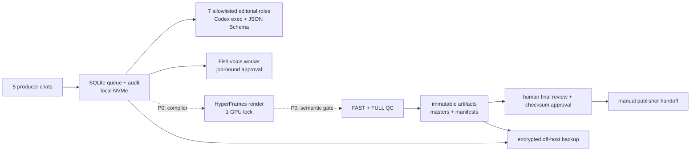

# Перенос Video Factory на сервер

Статус V2: проверяемый runbook миграции для пяти редакционных линий и целевой
нагрузки 10–15 вертикальных роликов в сутки. Он описывает конечную production-
топологию, но не объявляет незавершённые обработчики готовыми.

## Текущая готовность к cutover

| Контур | Состояние | Что это означает |
|---|---|---|
| Очередь, leases, heartbeat, DLQ, backup | READY | Можно переносить и запускать на одном writer-хосте |
| `research` → `editor` | READY | Семь schema-bound Codex-ролей запускаются headless |
| Fish Audio `voice` | READY | Job-bound approval, секрет вне очереди, не более двух генераций |
| Motivation `source_audio` | BLOCKED | Нужен отдельный rights-bound handler исходной речи |
| Media discovery/freeze | BLOCKED | CLI есть, queue-stage и asset selection ещё не завершены |
| Shotlist → HyperFrames project → render | BLOCKED | Wrapper пока рендерит только уже собранный project |
| Semantic + technical QC | PARTIAL | Технический FFmpeg QC есть, смысловой visual gate не завершён |
| Outbox/publish | HUMAN ONLY | Публикация намеренно не автономна |

**Не переключайте production writer на сервер**, пока все строки `BLOCKED` не
закрыты одним реальным acceptance job: утверждённая идея → локальные media
hashes → звук → shotlist → 1080×1920 MP4 → QC → pending approval. До этого
сервер допустим для shadow-очереди, ресёрча, сценариев и controlled voice jobs.

## Что нужно предоставить владельцу системы

Обязательно:

- SSH-доступ к чистому Ubuntu 24.04 LTS хосту с `sudo`, статическим публичным IP
  или VPN-доступом;
- выбранный сервер минимум 16 vCPU, 32 ГБ RAM, 1 ТБ NVMe и NVIDIA 12+ ГБ VRAM;
- новый Fish Audio API key вместо опубликованного в переписке, Fish
  `reference_id` и документированное право коммерческого использования голоса;
- отдельный OpenAI Platform project/API budget для production либо заранее
  проверенный headless device login; подписка ChatGPT Pro сама по себе не
  является гарантированным API-бюджетом;
- перечень аккаунтов/регионов публикации и подтверждение, кто нажимает финальный
  publish gate;
- права или лицензии на speaker clips, B-roll, музыку, шрифты и фирменные
  элементы. Ссылка на TikTok/Instagram не является лицензией;
- off-host backup target и срок хранения.

Желательно: домен для dashboard, S3-compatible bucket с versioning, официальный
TikTok/Instagram API application или approved scheduler, Telegram bot для
доставки preview. Секреты передаются через secret manager/SSH-сеанс, а не в чат,
Git или task JSON.

Расчёт текущего LLM/TTS/render/storage baseline вынесен в
[COST_REPORT.md](../COST_REPORT.md). Аренда конкретного GPU-сервера добавляется
по фактическому тарифу провайдера; consumer ChatGPT Pro не включается в расчёт
API usage.

## Короткий вердикт

Для первого production-переноса используйте **один Ubuntu 24.04 LTS сервер с
локальным NVMe и одной NVIDIA GPU**. Оставьте SQLite/WAL и тяжёлый render на
одном хосте. Это соответствует текущей архитектуре и не создаёт ложного
распределённого состояния.

Файлы, очередь, HyperFrames, FFmpeg, кэш и Fish Audio переносятся. Пять
Codex-чатов остаются редакционными интерфейсами, а реализованная unattended-обработка
разрешённых ролей выполняется отдельным `video-factory worker`: он берёт
fenced lease, продлевает его heartbeat-ом и обменивается с доверенным
schema-bound handler только JSON по stdin/stdout. `final_review` и `publisher`
не являются автономными ролями; публикация остаётся отдельным человеческим
гейтом.

## Рекомендуемая топология V2



## Железо

Минимум для стабильного старта:

- 16 vCPU;
- 32 ГБ RAM, лучше 64 ГБ при локальной транскрибации/Whisper;
- NVIDIA с 12–24 ГБ VRAM: L4/A10 или RTX 3060/4070-class и выше;
- 1 ТБ локального NVMe для state/cache/scratch, плюс отдельное хранилище
  артефактов или регулярный off-host backup;
- 200+ ГБ свободного места перед первой миграцией.

Начинайте с `HYPERFRAMES_WORKERS=1`. Второй render-slot включайте только после
реального soak-теста: два параллельных WebGL/encode процесса часто дают меньше
пропускной способности из-за VRAM, I/O и thermal throttling.

## Размещение данных

```text
/opt/video-factory/current/          код текущего release
/opt/video-factory/releases/         immutable предыдущие releases
/var/lib/video-factory/              SQLite, WAL, usage ledgers, locks
/var/lib/video-factory/cache/        content-addressed derived cache
/var/lib/video-factory/scratch/      frames и временные файлы
/var/lib/video-factory/voice_approvals/ job-bound JSON approvals голоса
/var/lib/video-factory/voices/       WAV + immutable VoiceManifest
/srv/video-factory/artifacts/        masters, manifests, rights evidence
/etc/video-factory/runtime.env       несекретная конфигурация
/etc/video-factory/secrets/fish_api_key root-owned source for systemd credential
/run/credentials/.../fish_api_key    ephemeral service-only credential
```

SQLite/WAL нельзя хранить на NFS, SMB, OneDrive или S3 и нельзя открывать с двух
хостов. S3-compatible storage подходит для immutable blobs, но не для живой
SQLite-базы.

## Установка базового окружения

1. Установите Ubuntu Server 24.04 LTS, security updates и NVIDIA driver.
2. Создайте отдельного пользователя без shell-admin прав:

```bash
sudo useradd --system --create-home --home-dir /var/lib/video-factory \
  --shell /usr/sbin/nologin video-factory
sudo useradd --system --no-create-home --shell /usr/sbin/nologin \
  video-factory-backup
sudo usermod --append --groups video-factory video-factory-backup
sudo install -d -o video-factory -g video-factory \
  /opt/video-factory/releases /var/lib/video-factory \
  /srv/video-factory/artifacts /etc/video-factory
sudo install -d -m 0750 -o video-factory -g video-factory \
  /var/lib/video-factory/agent_outputs \
  /var/lib/video-factory/cache \
  /var/lib/video-factory/codex_workspace \
  /var/lib/video-factory/metrics \
  /var/lib/video-factory/scratch \
  /var/lib/video-factory/voice_approvals \
  /var/lib/video-factory/voices
sudo install -d -m 0750 -o video-factory-backup -g video-factory-backup \
  /srv/video-factory/backups
```

Основная и Fish usage SQLite-базы должны создаваться с группой `video-factory`
и режимом не строже `0640`, чтобы отдельный backup-пользователь мог читать их
через supplementary group, но не мог изменять рабочее состояние.

3. Установите Python 3.11/3.12, Node 22, FFmpeg/ffprobe, Chromium dependencies,
   `rsync`, `flock`, `sqlite3`, `jq`, кириллические шрифты и утилиты NVIDIA.
4. Если используется Docker, установите Docker Engine и NVIDIA Container
   Toolkit по официальной документации. Для первого cutover bare-metal systemd
   проще и лучше соответствует текущему CLI/runtime.

Версии HyperFrames (`0.8.17`), Node, FFmpeg и браузера фиксируются в release
manifest. `node_modules`, кэш Chromium и render frames с Windows не копируются.

## Перенос кода

На Windows сначала сформируйте чистый архив без runtime-мусора:

```powershell
robocopy factory C:\VideoFactoryTransfer\factory /MIR `
  /XD node_modules snapshots renders .cache __pycache__ `
  /XF *.pyc *.tmp
```

`.media` здесь намеренно **не исключается**: это frozen media ledger и часть
проектов может ссылаться на локальные BGM/SFX внутри него. После переноса
`rg -n "\.media/|\.media\\\\" factory/pilots` должен либо находить существующие
файлы, либо ссылки должны быть переписаны на проверенные `assets/` до cutover.

Передавайте архив по SSH/rsync и сверяйте SHA-256. На сервере каждый выпуск
лежит в новом каталоге `releases/<timestamp>`; symlink `current` меняется
атомарно только после тестов.

```bash
release_id=$(date -u +%Y%m%dT%H%M%SZ)
release=/opt/video-factory/releases/$release_id
# Распакуйте проверенный архив именно в $release, не в current.
python3 -m venv "$release/.venv"
"$release/.venv/bin/pip" install --upgrade pip
"$release/.venv/bin/pip" install "$release/factory"
"$release/.venv/bin/pip" install -r "$release/factory/deployment/requirements-dev.lock"
chmod +x "$release/factory/tools/"*.sh
"$release/.venv/bin/python" -m pytest "$release/factory/tests" -q
ln -sfn "$release" /opt/video-factory/current.next
mv -Tf /opt/video-factory/current.next /opt/video-factory/current
```

У каждого release свой venv; обычный code rollback меняет только `current` и
не откатывает живые БД. Базу восстанавливают только при подтверждённом
повреждении/несовместимой миграции и с зафиксированным RPO.

Codex CLI и HyperFrames ставятся один раз в pinned toolchain, чтобы workers и
render не ходили в npm во время выполнения:

```bash
sudo install -d -o video-factory -g video-factory /opt/video-factory/toolchain
cd /opt/video-factory/toolchain
sudo -u video-factory npm install --save-exact \
  @openai/codex@0.151.0 hyperframes@0.8.17
sudo -u video-factory npm ci --ignore-scripts=false
sudo -u video-factory \
  /opt/video-factory/toolchain/node_modules/.bin/codex --version
```

Для каждого HyperFrames-проекта выполняйте `npm ci` по lockfile. Не используйте
плавающий `npm install`, глобальный Codex или `npx --yes` в production.
Preflight требует ровно Codex CLI `0.151.0`, а worker задаёт модель явно:
`VIDEO_FACTORY_CODEX_MODEL=gpt-5.4`.

`VIDEO_FACTORY_CODEX_WORKSPACE` указывает на отдельный пустой runtime-каталог,
а не на release. Все необходимые входы уже передаются как ограниченный JSON.
Это уменьшает доступную модели поверхность файлов и не заставляет каждый
editorial turn исследовать весь репозиторий.

## Аутентификация Codex на headless-сервере

Для программного production-процесса основной вариант — отдельный API key с
лимитом расходов. Он тарифицируется через OpenAI Platform отдельно от подписки
ChatGPT. Ключ не добавляется в `runtime.env`, unit, аргументы процесса, release
archive или логи. Создайте root-readable staging secret, один раз выполните
login от имени сервисного пользователя и затем удалите staging-файл:

```bash
sudo install -m 0400 -o root -g root /dev/null \
  /etc/video-factory/secrets/codex_api_key
sudoedit /etc/video-factory/secrets/codex_api_key
sudo -u video-factory -H sh -c \
  '/opt/video-factory/toolchain/node_modules/.bin/codex login --with-api-key' \
  < /etc/video-factory/secrets/codex_api_key
sudo shred -u /etc/video-factory/secrets/codex_api_key
sudo -u video-factory -H \
  /opt/video-factory/toolchain/node_modules/.bin/codex login status
```

Если используется доступ подписки ChatGPT, на headless-хосте предпочтителен
device-code flow (beta):

```bash
sudo -u video-factory -H \
  /opt/video-factory/toolchain/node_modules/.bin/codex login --device-auth
sudo -u video-factory -H \
  /opt/video-factory/toolchain/node_modules/.bin/codex login status
```

Device login нужно заранее разрешить в настройках безопасности ChatGPT или у
администратора workspace. Копирование `~/.codex/auth.json` — только fallback:
этот файл содержит access tokens и должен иметь владельца `video-factory`, режим
`0600`, не попадать в Git, backup артефактов, тикеты и переписку. Кеш входа не
копируется между несколькими runtime-пользователями. Для production SLA нельзя
полагаться на незафиксированный лимит ChatGPT-подписки: API key с бюджетом и
алертами даёт измеряемый usage-based контур.

Официальная документация подтверждает `codex exec` как non-interactive режим,
рекомендует API-key login для программных сценариев и `codex login
--device-auth` для headless-входа:
[non-interactive mode](https://learn.chatgpt.com/docs/non-interactive-mode),
[authentication](https://learn.chatgpt.com/docs/auth).

Пять существующих Codex-чатов не копируются в Linux как базы или процессы. Они
остаются пользовательскими редакционными интерфейсами в аккаунте; их IDs в
`lanes/registry.json` — routing metadata. Server workers получают только
ограниченный task JSON из SQLite и не управляют UI чатов. Это разделяет
человеческое обсуждение и воспроизводимый headless runtime.

## Секрет Fish Audio

Скомпрометированный ключ из переписки нужно **отозвать и создать заново** до
cutover. Windows DPAPI-файл не переносится. Linux runtime поддерживает
`FISH_API_KEY_FILE`, причём явный отсутствующий/пустой файл блокирует запуск.

```bash
sudo install -d -m 0700 -o root -g root /etc/video-factory/secrets
sudo install -m 0400 -o root -g root /dev/null \
  /etc/video-factory/secrets/fish_api_key
sudoedit /etc/video-factory/secrets/fish_api_key
```

Для daemon unit подключите этот файл через
`LoadCredential=fish_api_key:/etc/video-factory/secrets/fish_api_key` и задайте
`FISH_API_KEY_FILE=%d/fish_api_key`. Не создавайте секрет вручную в `/run`:
этот каталог очищается при reboot. Альтернативы — Vault или secret mount.
Не передавайте ключ аргументом CLI, не кладите его в `.env`, manifest, backup
артефактов или JSON-логи.

Каждая разрешённая кастомная озвучка дополнительно требует job-bound файла
`/var/lib/video-factory/voice_approvals/<job_id>.json`, соответствующего
`voice_rights_approval.schema.json`. Approval создаётся до первого платного
вызова, содержит тот же `reference_id` и не подменяет коммерческую лицензию.
Первая генерация кэшируется, повтор с тем же текстом денег не тратит; вторая
разрешена только по формализованному defect artifact.

## Конфигурация runtime

Установите [server.env.example](./server.env.example) как root-owned
несекретную конфигурацию и поправьте только пути/лимиты:

```bash
sudo install -m 0644 -o root -g root \
  factory/deployment/server.env.example /etc/video-factory/runtime.env
sudoedit /etc/video-factory/runtime.env
```

Затем:

```bash
set -a
source /etc/video-factory/runtime.env
set +a

"/opt/video-factory/current/.venv/bin/video-factory" init \
  --db "$VIDEO_FACTORY_DB"

"/opt/video-factory/current/.venv/bin/video-factory" optimize-runtime \
  --profile balanced \
  --target 15 \
  --runtime-root /var/lib/video-factory \
  --apply

"/opt/video-factory/current/.venv/bin/video-factory" queue-limit \
  --role render --max-leased 1 --db "$VIDEO_FACTORY_DB"
```

На одном GPU authoritative render запускается только через
`factory/tools/render_hyperframes.sh`; wrapper использует общий `flock` и не
даёт двум чатам одновременно занять GPU.

```bash
factory/tools/render_hyperframes.sh \
  factory/pilots/my-video \
  /srv/video-factory/artifacts/my-video/master.mp4 high 30 16
```

Headless worker получает resource lock **до** claim и продлевает lease
heartbeat-ом. Для render всё равно запускается ровно один GPU worker и
`VIDEO_FACTORY_RENDER_LEASE_SECONDS=7200`: это защищает NVENC/WebGL от двойного
запуска и не превращает долгую очередь у GPU-lock в ложную leased-работу. Не
применяйте runtime-план с render WIP=2 одновременно с глобальным lock=1.

## Граница автоматизации V2

На сервер переносятся инструменты reproducible render, FAST/FULL technical QC,
frozen media, Fish-лимит, SQLite/WAL queue, fenced heartbeat workers,
DLQ/rework lifecycle, artifact invalidation, metrics collector и audit trail.
Это ещё не означает, что все инструменты связаны queue handlers. Codex автономно
обрабатывает только allowlist ролей `research`, `privacy_review`,
`sensitivity_review`, `medical_review`, `rights`, `script`, `editor`. Каждый ответ
проверяется JSON Schema и доменной валидацией; недостаток данных обязан закрыть
гейт, а не угадываться.

`final_review` и `publisher` намеренно отсутствуют в allowlist и не должны
запускаться как instances systemd template. Финальный просмотр, проверка прав,
checksum approval и фактическая отправка остаются действиями человека. Поэтому
V2 означает unattended редакционную подготовку и controlled voice, но до
закрытия P0-строк таблицы выше не означает unattended MP4 production и никогда
не означает автономную публикацию.

## Перенос state без повреждения

1. На Windows остановите создание jobs и дождитесь завершения всех leases.
2. Сделайте online backup SQLite (`sqlite3 .backup` / Backup API), а не обычную
   копию живого файла без WAL.
3. Сформируйте SHA-256 inventory для базы, masters, frozen media, rights
   evidence, scripts, sources и manifests.
4. Перенесите backup в `/var/lib/video-factory`, artifacts — в
   `/srv/video-factory/artifacts` через `rsync --checksum`.
5. Не переносите `.write-lock`, `render.lock`, tmp, frames cache и
   `node_modules`.
6. Никогда не запускайте Windows и сервер как writers одной SQLite-базы.

## Приёмочный прогон

Из `/opt/video-factory/current`:

```bash
/opt/video-factory/current/.venv/bin/python \
  factory/tools/server_preflight.py \
  --runtime-env /etc/video-factory/runtime.env --require-gpu
/opt/video-factory/current/.venv/bin/python -m pytest factory/tests -q
/opt/video-factory/current/.venv/bin/python -m video_factory lanes \
  --registry factory/lanes/registry.json
/opt/video-factory/current/.venv/bin/python -m video_factory freshness-gate \
  --lane celebrity_news --checked-at "$(date --iso-8601=seconds)"
ffmpeg -version
ffprobe -version
nvidia-smi
ffmpeg -hide_banner -encoders | grep -E 'libx264|h264_nvenc'
ffmpeg -hide_banner -f lavfi -i testsrc2=size=1080x1920:rate=30 -t 2 \
  -c:v h264_nvenc -f null -
findmnt -no FSTYPE,TARGET /var/lib/video-factory
sqlite3 "$VIDEO_FACTORY_DB" 'PRAGMA journal_mode; PRAGMA integrity_check;'
```

`server_preflight.py` завершается с кодом `2`, если drift обнаружен: другая
версия Codex, неявная/другая модель, отсутствующий login, network filesystem для
SQLite, повреждённая/не-WAL база, отсутствующие prompt files, FFmpeg,
HyperFrames или GPU/NVENC. Скрипт также отвергает raw `OPENAI_API_KEY`,
`CODEX_API_KEY` и `FISH_API_KEY` в `runtime.env`; секреты не выводятся.

Далее обязательны; shadow batch не заменяет media E2E:

1. один deterministic sample render;
2. повтор того же render и сравнение checksum/visual diff;
3. FAST QC draft и FULL QC master;
4. проверка кириллицы, встроенных шрифтов и V3 visual/audio gate из
   [QUALITY_BAR.md](../quality/QUALITY_BAR.md);
5. один реальный health E2E job без ручных промежуточных файлов;
6. один motivation E2E job с исходной речью и item-level rights;
7. смешанная партия по одному ролику на линию;
8. shadow batch из 15 jobs, затем backlog/soak из 30 jobs без публикации;
9. восстановление backup в отдельный каталог;
10. только после этого — первые 10 production-роликов с render concurrency 1.

## Наблюдаемость

JSON-логи должны содержать `job_id`, `task_id`, lane, role, attempt, duration,
exit code и hash артефакта, но не API key, полный lease token или приватный
payload. Минимальные метрики:

- queue depth и age старейшего job;
- expired leases, retries и dead tasks;
- gate failures по типу;
- render/QC duration и failure rate;
- cache hit rate;
- диск, inode, RAM, CPU, GPU, VRAM и температура;
- provider latency, число Fish generation и стоимость.

Алерты: dead task, очередь старше SLA, stale celebrity research, диск >80%,
render failure, backup failure, GPU OOM и истёкший lease.

## Systemd

В `factory/deployment/systemd/` лежат units для production preflight,
allowlisted editorial workers, metrics, lease recovery и daily backup.
Установите их, проверьте и сначала запустите preflight:

```bash
sudo install -m 0644 factory/deployment/systemd/*.{service,timer} /etc/systemd/system/
sudo systemd-analyze verify /etc/systemd/system/video-factory-*.service \
  /etc/systemd/system/video-factory-*.timer
sudo systemctl daemon-reload
sudo systemctl restart video-factory-preflight.service
sudo systemctl status --no-pager video-factory-preflight.service
```

Только после `active (exited)` включите сервисные timers, семь разрешённых
editorial instances и controlled voice worker:

```bash
sudo systemctl enable --now \
  video-factory-recover.timer \
  video-factory-backup.timer \
  video-factory-metrics.timer

sudo systemctl enable --now \
  video-factory-worker@research.service \
  video-factory-worker@privacy_review.service \
  video-factory-worker@sensitivity_review.service \
  video-factory-worker@medical_review.service \
  video-factory-worker@rights.service \
  video-factory-worker@script.service \
  video-factory-worker@editor.service

sudo systemctl enable --now video-factory-voice.service
```

Template перед start выполняет fail-closed role check, после чего запускает
реальный heartbeat worker с доверенным `video_factory.editorial_handler`.
Попытка запустить `video-factory-worker@final_review.service` или
`video-factory-worker@publisher.service` отклоняется `ExecCondition`.
`video-factory-metrics.timer` раз в минуту идемпотентно материализует завершённые
queue attempts и атомарно обновляет:

```text
/var/lib/video-factory/metrics/last-collection.json
/var/lib/video-factory/metrics/latest-summary.json
```

Проверка эксплуатации:

```bash
systemctl list-units 'video-factory-worker@*'
systemctl list-timers 'video-factory-*'
journalctl -u 'video-factory-worker@*.service' --since -1h --no-pager
journalctl -u video-factory-voice.service --since -1h --no-pager
journalctl -u video-factory-metrics.service --since -1h --no-pager
```

Worker JSON-логи не должны содержать prompt payload, API key или полный lease
token. После смены release, runtime config или Codex auth выполняйте
`systemctl restart video-factory-preflight.service`, и только затем rolling
restart worker instances.

## Backup и rollback

- Daily encrypted SQLite online backup: 30 дней.
- Weekly: 12 недель; monthly: 12 месяцев.
- Artifact index, manifests, rights snapshots, sources и masters сохраняются
  отдельно от scratch/cache.
- Runtime-пользователь не должен иметь право удалять off-host backup.
- Раз в месяц выполняется restore drill.

`factory/tools/backup_server_state.sh` делает Online Backup и `integrity_check`
для **обеих** authoritative баз: основной queue DB и Fish usage ledger. Off-host
репликация должна быть зашифрована и проверена до включения локальной очистки.

Code rollback не восстанавливает старую БД. Восстановление данных — отдельная
аварийная процедура после остановки writers, фиксации RPO и сохранения копии
повреждённого состояния для расследования.

Rollback: остановить server workers, подтвердить отсутствие активных leases,
вернуть symlink на прошлый release и восстановить последнюю консистентную базу.
Windows enqueue можно включить только после остановки серверного writer.

## Когда переходить на несколько серверов

Не раньше, чем один хост упирается в измеренный bottleneck. При двух и более
writers очередь/metadata мигрирует в PostgreSQL; immutable blobs — в S3 с
versioning. SQLite не растягивается по сети, Redis не добавляется как второй
источник истины, а render nodes получают lease и сохраняют checksum результата.

## Контрольный чеклист переключения

- [ ] Новый Fish key создан, старый отозван; voice license/reference подтверждены.
- [ ] Codex login status и отдельный API budget/spend alerts проверены.
- [ ] Wheel/sdist smoke загрузил все 16 canonical schemas.
- [ ] `server_preflight.py --require-gpu` вернул `ok=true`.
- [ ] SQLite integrity=`ok`, journal=`wal`, база находится на локальном NVMe.
- [ ] Code/assets/state inventory перенесён с SHA-256 без Windows absolute paths.
- [ ] Семь editorial workers и voice worker прошли shadow jobs.
- [ ] P0 handlers `media/source_audio/compiler/render/semantic-qc/outbox bridge` готовы.
- [ ] Health E2E создал реальный 1080×1920 MP4 без ручных промежуточных файлов.
- [ ] Motivation E2E создал MP4 с лицензированной исходной речью без Fish TTS.
- [ ] Смешанная партия 5, затем shadow 15/30 завершились без DLQ drift.
- [ ] Backup восстановлен в отдельный каталог и прошёл integrity check.
- [ ] Windows writer остановлен; только после этого server writer включён.
- [ ] Publish по-прежнему требует checksum-bound human approval.

## Официальные документы

- Codex non-interactive mode: https://learn.chatgpt.com/docs/non-interactive-mode
- Codex authentication/headless device login: https://learn.chatgpt.com/docs/auth
- Ubuntu 24.04 LTS: https://documentation.ubuntu.com/release-notes/24.04/
- SQLite WAL: https://sqlite.org/wal.html
- SQLite Online Backup API: https://sqlite.org/backup.html
- PostgreSQL locking/`SKIP LOCKED`: https://www.postgresql.org/docs/current/sql-select.html
- NVIDIA Container Toolkit: https://docs.nvidia.com/datacenter/cloud-native/container-toolkit/latest/install-guide.html
- Docker Engine for Ubuntu: https://docs.docker.com/engine/install/ubuntu/
- S3 Versioning: https://docs.aws.amazon.com/AmazonS3/latest/userguide/Versioning.html
