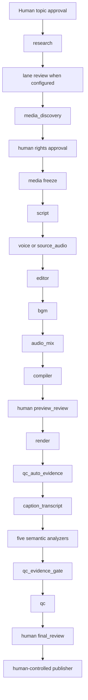

# Editorial Video Factory Architecture

> **Current control-plane topology (2026-08-30):** the canonical topology and
> exact task order are the five-lane registry in
> `factory/lanes/registry.json`: `war_history`, `celebrity_news`, `motivation`,
> `chinese_medicine`, and `health`, allocated 2–3 outputs per lane for 10–15 per
> day. No prose document, prompt, or schema inventory may shorten or reorder the
> registry DAG. Production remains review-first and fails closed on the
> lane-specific review, human rights approval, preview approval, evidence QC,
> human final review, and publication authorization.

## 1. Objective and boundaries

The factory prepares 10–15 short-form videos per working day across independent
topic lanes. It automates discovery, evidence collection, rights-audit
preparation, scripting, edit planning, caption planning, audio/program
compilation, rendering, and QC evidence production. Attributable humans retain
the topic, medical (where configured), rights, preview, final-review, and
publication decisions described below.

It does **not** publish autonomously. Topic selection and final pre-publication
approval are permanent human gates. Script approval is human during calibration
and for every yellow/red-risk job; after a topic cell proves at least 30
green-lane outputs without a material factual, rights, or policy defect, a
schema-valid script may pass automatically while remaining auditable. A
downstream publisher may act only on an explicit, recorded `publish_approved`
decision by an authorized human.

The design separates two concepts:

- **Agent specialization**: a shared base model receives a role prompt, a topic pack, approved tools, schemas, examples, and lane memory. This is the default design.
- **Fine-tuning**: model weights are changed using a curated training dataset. It is optional, not required for parallel topic agents, and should be considered only after the factory has a stable rubric, a measured baseline, and enough accepted/rejected examples to evaluate improvement safely.

Calling a topic agent “trained” must not imply fine-tuning unless a versioned fine-tuned model is actually deployed.

## 2. Operating model

### 2.1 Topic lanes

Run five independent editorial lanes. Each lane uses the shared task contracts,
loads its own topic pack, and owns its queue pod, daily target, rejected-topic
memory, source policy, and performance history. Lanes may work concurrently
without sharing unverified claims, human approvals, or uncleared assets.

Recommended daily allocation:

| Lane | Base target | Stretch target |
|---|---:|---:|
| War history | 2 | 3 |
| Celebrity news | 2 | 3 |
| Motivation | 2 | 3 |
| Chinese medicine | 2 | 3 |
| Health | 2 | 3 |
| **Total** | **10** | **15** |

Allocation should be rebalanced weekly using acceptance rate, rights-clearance rate, editing time, retention, and correction rate—not raw view count alone.

### 2.2 Roles

The registry is authoritative for order. Brackets below mean the registry
selects one lane-specific role, not that a worker may choose or skip a task:

`research -> [sensitivity_review/privacy_review/medical_review/none] -> media_discovery -> rights -> media -> script -> [voice/source_audio] -> editor -> bgm -> audio_mix -> compiler -> preview_review -> render -> qc_auto_evidence -> caption_transcript -> captions_analyzer -> facts_analyzer -> policy_analyzer -> dedup_analyzer -> visual_analyzer -> qc_evidence_gate -> qc -> final_review -> publisher`

| Role/group | Responsibility | Gate/authority boundary | Must not do |
|---|---|---|---|
| Orchestrator and topic editor | Creates the daily slate, records explicit topic decisions, builds the exact registry dependency chain, enforces WIP and routes rework | Human topic selection precedes the registry DAG | Invent facts, shorten the DAG, waive a gate, or approve publication |
| `research` + lane review | Builds the claim ledger and applies sensitivity/privacy/medical policy | `medical_review` is an attributable qualified-human gate; other reviews fail closed on uncertainty | Add unsupported facts or silently soften risk |
| `media_discovery` | Produces candidate media and provenance evidence | Discovery output is not permission | Treat a URL or provider result as a rights decision |
| `rights` | Produces and reviews the item-level RightsManifest | Only an attributable human may complete the exact manifest-SHA and asset-list approval | Treat public availability, attribution, or fair use as automatic permission |
| `media` | Freezes only approved asset bytes and evidence | Must bind the approved RightsManifest | Substitute, download, or edit a blocked asset |
| `script` + `voice`/`source_audio` + `editor` | Produces evidence-linked copy, authoritative speech timing, captions, shotlist, and edit plan | Motivation uses source speech only; narrated lanes use the bounded voice contract | Research new facts, use TTS for motivation, or introduce uncleared media |
| `bgm` + `audio_mix` | Freezes licensed music and creates the checksum-bound program mix | BGM rights and receipt bytes remain bound; B-roll audio stays muted | Download unknown music or replace authoritative speech |
| `compiler` + `preview_review` | Compiles the deterministic HyperFrames project and binds its immutable preview | Only the human preview decision opens render | Render a changed or unapproved project tree |
| `render` | Executes the approved deterministic project | Output binds the exact project and program mix | Substitute assets or rewrite narration silently |
| Evidence producers + `qc_evidence_gate` + `qc` | Runs combined technical/audio/rights evidence, transcript, five semantic analyzers, immutable evidence bundle, and final FULL QC | Every artifact binds the same render SHA; missing/stale evidence blocks | Self-certify missing evidence or grant publication approval |
| `final_review` | Reviews the actual render and destination metadata | Attributable checksum-bound human decision | Delegate final approval to an unattended worker |
| `publisher` | Materializes or executes an explicitly authorized publish action | Remains human-controlled and destination-bound | Schedule or publish without the matching approval record |

## 3. Canonical job contract

Every video is one versioned job. Agents append artifacts; they do not overwrite previous approvals.

```json
{
  "job_id": "2026-08-27-space-004",
  "batch_id": "2026-08-27-wave-2",
  "topic_pack": "space_technology@1.0.0",
  "state": "researched",
  "state_version": 6,
  "priority": 70,
  "topic_card": {},
  "source_registry": [],
  "claim_ledger": [],
  "asset_manifest": [],
  "script_versions": [],
  "approved_script_id": null,
  "caption_plan": [],
  "edit_decision_list": [],
  "audio_plan": {},
  "render_artifacts": [],
  "qc_reports": [],
  "approvals": [],
  "audit_log": []
}
```

Required invariants:

- Every factual script sentence references one or more supported `claim_id` values.
- Every visual and audio item references a rights-reviewed `asset_id`.
- `rights_cleared` means every asset selected for the current edit has an allowed use and recorded obligations; it does not mean every discovered candidate is usable.
- Approval records include actor, role, timestamp, artifact ID/version, decision, and optional notes.
- Any material script or asset change after approval invalidates dependent approvals and returns the job to the earliest affected state.
- The final human approval is tied to the render checksum and destination metadata. A changed file, caption, thumbnail, title, account, or destination needs renewed approval.

## 4. State machine



Every box corresponds to one or more ordered registry tasks; task state is
durable (`queued`, `leased`, `completed`, `failed`, or `dead`) rather than a
second prose-only job state machine. Only the human topic editor may approve a
topic. A qualified human completes `medical_review`; an attributable human
completes `rights`, `preview_review`, and `final_review`. Publication is never
inferred from an earlier topic, script, preview, or QC decision.

Blocked jobs are not silently discarded. The orchestrator records a reason code, stops downstream work, and either routes to a fallback topic/asset or presents the blockage to a human.

## 5. Editorial and safety gates

### G0 — Candidate completeness

- Topic has a one-sentence promise and a clear audience payoff.
- At least two discoverable evidence URLs are present.
- Visual availability and obvious rights risk are estimated.
- Duplicate check covers the previous 30 days within the cell.

### G1 — Human topic selection

- Human selects the production slate from ranked candidates.
- Selection considers novelty, evidence, rights feasibility, visual strength, sensitivity, and lane diversity.
- A high score never bypasses this gate.

### G2 — Evidence

- Every material claim has a claim-ledger entry.
- Prefer a primary source; significant or surprising claims also need an independent corroborating source.
- Sources record publisher, author/organization, publication date, access date, URL, and relevant excerpt or paraphrase.
- Current values, statuses, records, laws, prices, schedules, scientific conclusions, and public roles are checked as of production date.
- Conflicts, uncertainty, preprints, estimates, simulations, and sponsor-originated claims are labeled.
- Topic-pack `forbidden_claims` are enforced.
- The last fact-check timestamp must pass the lane TTL at the intended
  publication time. A stale current-affairs job returns to research even when
  its script and render are unchanged.

### G3 — Rights and privacy

- Every planned asset is `approved`, `approved_with_conditions`, or removed.
- License/permission, owner, territory, platforms, commercial use, edit rights, duration, expiry, attribution, and proof location are recorded.
- Public availability is not evidence of permission.
- A passing RightsManifest is checksum-bound to an attributable human approval
  that enumerates every reviewed asset. Autonomous agents may research terms,
  but they cannot complete the production `rights` gate.
- No watermark removal, access-control bypass, deceptive provenance, staged-rescue content, or private/sensitive personal data.
- Minors, victims, medical contexts, private individuals, sacred/culturally sensitive material, and user-generated footage receive elevated review.
- Medical-lane safety approval is never delegated to the autonomous Codex worker. A passing `medical_review` records the human reviewer's identity, qualification, timestamp, and approval note; absence of any field blocks downstream work.

### G4 — Script approval

- Script uses only supported claim IDs.
- Hook is strong but not misleading.
- Uncertainty survives compression.
- Names, numbers, dates, pronunciation notes, and topic-pack tone are correct.
- Defamation, stereotyping, dehumanization, and unsupported motive/mental-state claims are absent.
- Automatic approval is allowed only in a calibrated green lane; otherwise a
  human editor records the decision. Any automatic approval remains visible in
  the audit log and can be sampled for review.

### G5 — Edit-plan integrity

- Every beat maps to an approved asset ID and valid source time range.
- Captions match the approved narration and remain inside platform-safe zones.
- Reenactments, simulations, archive footage, and AI-generated imagery are labeled when a reasonable viewer could mistake them for the claimed event.
- No clip implies a different species, mission, place, person, date, or event.
- Minimal edits to third-party footage do not satisfy originality. The approved
  script and EDL must identify the new analysis, explanation, comparison, or
  storyline contributed by the factory.
- Background music must be a separate immutable WAV whose bytes, source asset,
  local license receipt, exact RightsManifest, and attributable human approval
  are all bound by SHA-256. Missing or changed evidence blocks compilation.
- Spoken content and timing remain authoritative from `VoiceManifest` or
  `SourceAudioManifest`. `ProgramAudioManifest` may mix and normalize that audio
  but may not replace its identity or silently substitute a different take.
- The reproducible mix profile is recorded in the manifest. The baseline is
  audible speech-forward BGM at -9 dB before speech-keyed sidechain ducking,
  followed by two-pass normalization to -15 LUFS / -1 dBTP. HyperFrames uses
  exactly one checksum-bound program-mix track and mutes all B-roll audio.

### G6 — QC

- Render проходит последовательный evidence DAG: combined technical/audio/rights
  scan, word-level transcript, captions/facts/policy/dedup/visual analyzers,
  immutable evidence bundle и повторный FULL master scan. Ни один producer не
  может сам выдать финальный `qc_passed`.
- Technical: duration, aspect, codec, loudness, peak, black frames, duplicate frames, caption overflow, missing audio.
- Editorial: opening promise delivered, pacing, no dangling context, correct pronunciation and captions.
- Factual: claim-to-script diff and on-screen-number check.
- Rights: final render asset hash set equals cleared manifest.
- Accessibility: readable captions, sufficient contrast, meaningful labels.
- Provenance: archive/stock/reenactment/simulation/AI labels match the asset
  manifest and remain readable in the final render.

### G7 — Human pre-publication approval

The human reviews the actual final file plus title, description, thumbnail, destination account, scheduled time, disclosure labels, and rights obligations. The decision is recorded against a checksum. No approval means no publication.

## 6. Throughput design

### 6.1 Daily waves

Use three staggered waves rather than one large batch:

| Wave | Target jobs | Editorial intent |
|---|---:|---|
| Morning | 4–5 | Highest-confidence evergreen and timely topics |
| Midday | 3–5 | Replacements for blocked jobs plus second priority set |
| Evening | 3–5 | Final slate, next-day preproduction, experiments capped at 20% |

The scout should maintain 2.0–2.5 viable candidates for every desired publication. For 15 outputs, start with about 35 candidates, ask humans to approve 18–20, and expect evidence/rights/QC attrition before 15 final approvals.

### 6.2 Recommended WIP limits

| Lane | WIP limit | Service target per job |
|---|---:|---:|
| Human topic review | 20 per wave | 10–15 min per batch |
| Research | 9 total / lane limits from runtime configuration | 20–35 min |
| Human rights review | 9 total / lane limits from runtime configuration | 15–30 min |
| Script drafting | 6 total / lane limits from runtime configuration | 10–20 min |
| Human script review | 8 per batch | 15–25 min per batch |
| Edit planning/render | 6 total | 20–40 min |
| QC | 6 total | 8–15 min |
| Human publish review | 5 per batch | 10–15 min per batch |

WIP is counted per job, not per agent process. Scaling agent count without WIP limits creates stale research, rights debt, and review bottlenecks.

### 6.3 Backpressure and fallback

- If human topic review is full, stop scouting for that wave.
- If rights clearance drops below 70%, favor owned, public-domain, directly licensed, or generated-and-labeled visual formats.
- If research is blocked, replace the topic; do not weaken the evidence gate.
- If script approval becomes the bottleneck, reduce variants from three to two before increasing daily output.
- If QC failure exceeds 10%, pause the affected template and run root-cause review.
- Maintain two evergreen, fully researched fallback jobs per lane; their current claims and rights must be revalidated before use.

## 7. Scheduling and orchestration rules

1. The orchestrator creates a daily slate, pins `topic_pack` and registry
   versions, and records the human topic decision.
2. Separate lanes may run concurrently, but every accepted job receives exactly
   the dependency order from its registry `roles` array.
3. A role becomes eligible only after its immediate registry predecessor has a
   schema-valid, checksum-bound passing result. Human gates remain queued until
   the attributable decision is supplied.
4. Motivation selects `source_audio`; all other lanes select `voice`. No prompt
   may switch this branch.
5. Failures route backward to the earliest owning role; downstream workers never
   patch upstream truth or reuse a stale approval silently.
6. Every prompt execution records model/version, prompt version, tool calls,
   input artifact hashes, output hash, latency, and token/cost metrics.

## 8. Metrics

Track per cell and globally:

- Candidate-to-topic approval rate
- Research pass/block rate and correction rate
- Rights-clearance rate and median clearance time
- Script first-pass human acceptance rate
- Mean revisions per accepted script
- Render and QC pass rates
- Human publish approval rate
- Post-publication factual/rights correction rate
- Production lead time and active touch time
- 1-second hold, 3-second hold, completion, rewatches, saves, shares, qualified comments
- Topic fatigue and duplicate-theme rate

Do not optimize solely for views. Safety corrections, rights disputes, misleading-hook complaints, and human override rate are hard counter-metrics.

## 9. Fine-tuning decision checkpoint

Stay with prompt/topic-pack specialization until all of the following are true:

- At least several hundred versioned examples contain inputs, outputs, human edits, rejection reasons, and final outcomes.
- The task is stable enough to define a train/test split without temporal leakage.
- A prompt-only baseline and evaluation rubric exist.
- Fine-tuning has a narrow target such as house-style compression or caption segmentation—not factual recall or rights judgment.
- Offline evaluation shows improvement without increasing unsupported claims, homogenization, or safety errors.

Research and rights decisions must continue to use current external evidence even if a fine-tuned model is introduced.
