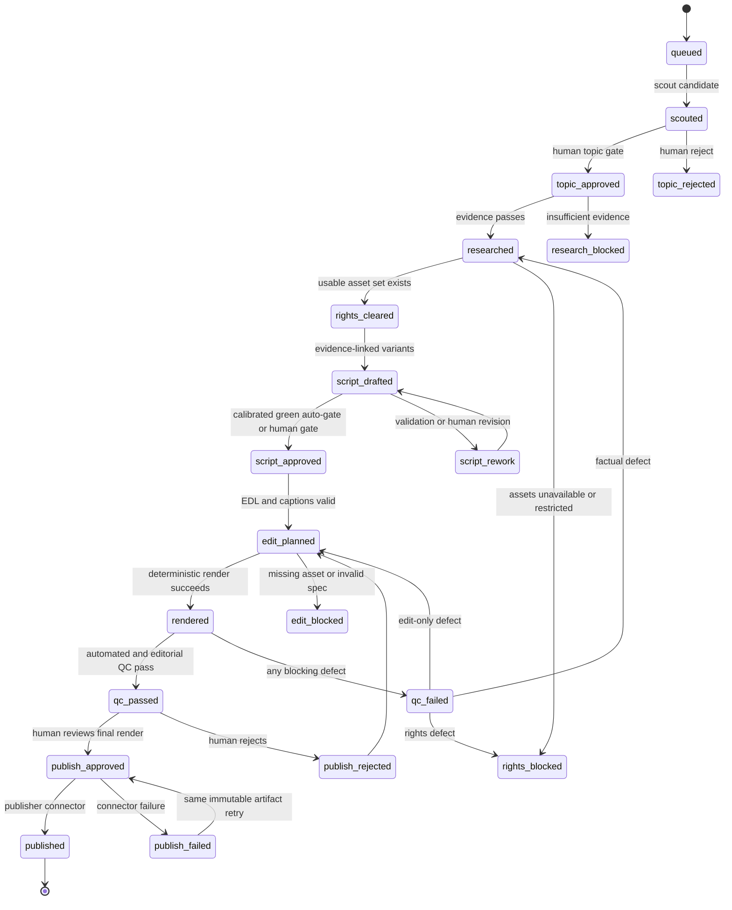

# Editorial Video Factory Architecture

> **Current deployment (2026-08-29):** the canonical topology is the five-lane registry in `factory/lanes/registry.json`: `war_history`, `celebrity_news`, `motivation`, `chinese_medicine`, and `health`, allocated 2–3 outputs per lane for 10–15 per day. Release now fails closed on lane-specific freshness, visual provenance, originality, rights, and final human approval. The three-cell examples below document the earlier prototype and are retained only as migration context. Runtime role chains must come from the registry.

## 1. Objective and boundaries

The factory prepares 10–15 short-form videos per working day across independent topic lanes. It automates discovery, evidence collection, rights review, scripting, edit planning, caption planning, rendering hand-off, and QC reporting.

It does **not** publish autonomously. Topic selection and final pre-publication
approval are permanent human gates. Script approval is human during calibration
and for every yellow/red-risk job; after a topic cell proves at least 30
green-lane outputs without a material factual, rights, or policy defect, a
schema-valid script may pass automatically while remaining auditable. A
downstream publisher may act only on an explicit, recorded `publish_approved`
decision by an authorized human.

The design separates two concepts:

- **Agent specialization**: a shared base model receives a role prompt, a topic pack, approved tools, schemas, examples, and lane memory. This is the default design.
- **Fine-tuning**: model weights are changed using a curated training dataset. It is optional, not required for parallel topic agents, and should be considered only after the factory has a stable rubric, a measured baseline, and enough accepted/rejected examples to evaluate improvement safely.

Calling a topic agent “trained” must not imply fine-tuning unless a versioned fine-tuned model is actually deployed.

## 2. Operating model

### 2.1 Topic cells

Run three independent editorial cells, initially mapped to:

1. `space_technology`
2. `nature_animals`
3. `people_culture`

Each cell uses the same role prompts and state contract, but loads its own topic pack. A cell owns its queue, daily target, rejected-topic memory, source allowlist, and performance history. Cells may work concurrently without sharing unverified claims or uncleared assets.

Recommended daily allocation:

| Cell | Base target | Stretch target |
|---|---:|---:|
| Space & technology | 3 | 5 |
| Nature & animals | 3 | 5 |
| People & culture | 4 | 5 |
| **Total** | **10** | **15** |

Allocation should be rebalanced weekly using acceptance rate, rights-clearance rate, editing time, retention, and correction rate—not raw view count alone.

### 2.2 Roles

| Role | Responsibility | May change job state to | Must not do |
|---|---|---|---|
| Orchestrator | Creates batch IDs, assigns topic packs, enforces WIP limits, validates schemas, routes failures | Any routing state permitted by the transition table | Invent facts, waive a gate, approve publication |
| Scout | Finds timely, visual, sourceable topic candidates | `scouted` | Write a final script or claim that a public clip is reusable |
| Human topic editor | Selects candidates and sets priority | `topic_approved`, `topic_rejected` | Approve from headline only when evidence links are missing |
| Research agent | Builds a claim ledger from primary and independent sources | `researched`, `research_blocked` | Add unsupported facts to make a story stronger |
| Rights agent | Audits every proposed asset and records license/permission obligations | `rights_cleared`, `rights_blocked` | Treat public availability, attribution, or “fair use” as automatic permission |
| Script agent | Produces evidence-linked script variants using supported claim IDs only | `script_drafted` | Research new facts inside the script or remove uncertainty labels |
| Script gate | Automatically validates calibrated green-lane scripts; otherwise routes to a human editor | `script_approved`, `script_rework` | Approve unsupported claims or waive calibration/risk rules |
| Editor agent | Produces EDL, asset map, captions, audio plan, and render specification | `edit_planned`, `edit_blocked` | Use an asset not in the cleared manifest or publish |
| Render worker | Executes the approved deterministic edit specification | `rendered`, `render_failed` | Substitute assets or rewrite narration silently |
| QC agent | Runs technical, factual, rights, caption, and brand checks | `qc_passed`, `qc_failed` | Waive errors or grant publication approval |
| Human publisher | Reviews the actual final render and destination metadata | `publish_approved`, `publish_rejected` | Delegate final approval to an unattended agent |
| Publisher connector | Publishes only an approved immutable render checksum | `published`, `publish_failed` | Schedule or publish without a matching human approval record |

## 3. Canonical job contract

Every video is one versioned job. Agents append artifacts; they do not overwrite previous approvals.

```json
{
  "job_id": "2026-08-27-space-004",
  "batch_id": "2026-08-27-wave-2",
  "topic_pack": "space_technology@1.0.0",
  "state": "researched",
  "state_version": 6,
  "priority": 70,
  "topic_card": {},
  "source_registry": [],
  "claim_ledger": [],
  "asset_manifest": [],
  "script_versions": [],
  "approved_script_id": null,
  "caption_plan": [],
  "edit_decision_list": [],
  "audio_plan": {},
  "render_artifacts": [],
  "qc_reports": [],
  "approvals": [],
  "audit_log": []
}
```

Required invariants:

- Every factual script sentence references one or more supported `claim_id` values.
- Every visual and audio item references a rights-reviewed `asset_id`.
- `rights_cleared` means every asset selected for the current edit has an allowed use and recorded obligations; it does not mean every discovered candidate is usable.
- Approval records include actor, role, timestamp, artifact ID/version, decision, and optional notes.
- Any material script or asset change after approval invalidates dependent approvals and returns the job to the earliest affected state.
- The final human approval is tied to the render checksum and destination metadata. A changed file, caption, thumbnail, title, account, or destination needs renewed approval.

## 4. State machine



Only the human topic editor can create `topic_approved`. `script_approved` may
be created automatically only for a calibrated green-lane cell with a complete
claim ledger, cleared rights, no forbidden-claim hit, and a clean schema/rubric
validation; all other scripts require a human editor. Only the human publisher
can create `publish_approved`.

Blocked jobs are not silently discarded. The orchestrator records a reason code, stops downstream work, and either routes to a fallback topic/asset or presents the blockage to a human.

## 5. Editorial and safety gates

### G0 — Candidate completeness

- Topic has a one-sentence promise and a clear audience payoff.
- At least two discoverable evidence URLs are present.
- Visual availability and obvious rights risk are estimated.
- Duplicate check covers the previous 30 days within the cell.

### G1 — Human topic selection

- Human selects the production slate from ranked candidates.
- Selection considers novelty, evidence, rights feasibility, visual strength, sensitivity, and lane diversity.
- A high score never bypasses this gate.

### G2 — Evidence

- Every material claim has a claim-ledger entry.
- Prefer a primary source; significant or surprising claims also need an independent corroborating source.
- Sources record publisher, author/organization, publication date, access date, URL, and relevant excerpt or paraphrase.
- Current values, statuses, records, laws, prices, schedules, scientific conclusions, and public roles are checked as of production date.
- Conflicts, uncertainty, preprints, estimates, simulations, and sponsor-originated claims are labeled.
- Topic-pack `forbidden_claims` are enforced.
- The last fact-check timestamp must pass the lane TTL at the intended
  publication time. A stale current-affairs job returns to research even when
  its script and render are unchanged.

### G3 — Rights and privacy

- Every planned asset is `approved`, `approved_with_conditions`, or removed.
- License/permission, owner, territory, platforms, commercial use, edit rights, duration, expiry, attribution, and proof location are recorded.
- Public availability is not evidence of permission.
- No watermark removal, access-control bypass, deceptive provenance, staged-rescue content, or private/sensitive personal data.
- Minors, victims, medical contexts, private individuals, sacred/culturally sensitive material, and user-generated footage receive elevated review.

### G4 — Script approval

- Script uses only supported claim IDs.
- Hook is strong but not misleading.
- Uncertainty survives compression.
- Names, numbers, dates, pronunciation notes, and topic-pack tone are correct.
- Defamation, stereotyping, dehumanization, and unsupported motive/mental-state claims are absent.
- Automatic approval is allowed only in a calibrated green lane; otherwise a
  human editor records the decision. Any automatic approval remains visible in
  the audit log and can be sampled for review.

### G5 — Edit-plan integrity

- Every beat maps to an approved asset ID and valid source time range.
- Captions match the approved narration and remain inside platform-safe zones.
- Reenactments, simulations, archive footage, and AI-generated imagery are labeled when a reasonable viewer could mistake them for the claimed event.
- No clip implies a different species, mission, place, person, date, or event.
- Minimal edits to third-party footage do not satisfy originality. The approved
  script and EDL must identify the new analysis, explanation, comparison, or
  storyline contributed by the factory.

### G6 — QC

- Technical: duration, aspect, codec, loudness, peak, black frames, duplicate frames, caption overflow, missing audio.
- Editorial: opening promise delivered, pacing, no dangling context, correct pronunciation and captions.
- Factual: claim-to-script diff and on-screen-number check.
- Rights: final render asset hash set equals cleared manifest.
- Accessibility: readable captions, sufficient contrast, meaningful labels.
- Provenance: archive/stock/reenactment/simulation/AI labels match the asset
  manifest and remain readable in the final render.

### G7 — Human pre-publication approval

The human reviews the actual final file plus title, description, thumbnail, destination account, scheduled time, disclosure labels, and rights obligations. The decision is recorded against a checksum. No approval means no publication.

## 6. Throughput design

### 6.1 Daily waves

Use three staggered waves rather than one large batch:

| Wave | Target jobs | Editorial intent |
|---|---:|---|
| Morning | 4–5 | Highest-confidence evergreen and timely topics |
| Midday | 3–5 | Replacements for blocked jobs plus second priority set |
| Evening | 3–5 | Final slate, next-day preproduction, experiments capped at 20% |

The scout should maintain 2.0–2.5 viable candidates for every desired publication. For 15 outputs, start with about 35 candidates, ask humans to approve 18–20, and expect evidence/rights/QC attrition before 15 final approvals.

### 6.2 Recommended WIP limits

| Lane | WIP limit | Service target per job |
|---|---:|---:|
| Human topic review | 20 per wave | 10–15 min per batch |
| Research | 9 total / 3 per cell | 20–35 min |
| Rights review | 9 total / 3 per cell | 15–30 min |
| Script drafting | 6 total / 2 per cell | 10–20 min |
| Human script review | 8 per batch | 15–25 min per batch |
| Edit planning/render | 6 total | 20–40 min |
| QC | 6 total | 8–15 min |
| Human publish review | 5 per batch | 10–15 min per batch |

WIP is counted per job, not per agent process. Scaling agent count without WIP limits creates stale research, rights debt, and review bottlenecks.

### 6.3 Backpressure and fallback

- If human topic review is full, stop scouting for that wave.
- If rights clearance drops below 70%, favor owned, public-domain, directly licensed, or generated-and-labeled visual formats.
- If research is blocked, replace the topic; do not weaken the evidence gate.
- If script approval becomes the bottleneck, reduce variants from three to two before increasing daily output.
- If QC failure exceeds 10%, pause the affected template and run root-cause review.
- Maintain two evergreen, fully researched fallback jobs per cell; their current claims and rights must be revalidated before use.

## 7. Scheduling and orchestration rules

1. Orchestrator creates a daily slate and pins `topic_pack` versions.
2. Scout agents may run concurrently by cell.
3. After G1, research and preliminary rights discovery run concurrently, but the script cannot start until both required states pass.
4. Script agents receive immutable claim ledgers and topic packs.
5. Editor agents receive only the human-approved script and cleared asset manifest.
6. Failures route backward to the earliest owning role; downstream agents never patch upstream truth silently.
7. Every prompt execution records model/version, prompt version, tool calls, input artifact hashes, output hash, latency, and token/cost metrics.

## 8. Metrics

Track per cell and globally:

- Candidate-to-topic approval rate
- Research pass/block rate and correction rate
- Rights-clearance rate and median clearance time
- Script first-pass human acceptance rate
- Mean revisions per accepted script
- Render and QC pass rates
- Human publish approval rate
- Post-publication factual/rights correction rate
- Production lead time and active touch time
- 1-second hold, 3-second hold, completion, rewatches, saves, shares, qualified comments
- Topic fatigue and duplicate-theme rate

Do not optimize solely for views. Safety corrections, rights disputes, misleading-hook complaints, and human override rate are hard counter-metrics.

## 9. Fine-tuning decision checkpoint

Stay with prompt/topic-pack specialization until all of the following are true:

- At least several hundred versioned examples contain inputs, outputs, human edits, rejection reasons, and final outcomes.
- The task is stable enough to define a train/test split without temporal leakage.
- A prompt-only baseline and evaluation rubric exist.
- Fine-tuning has a narrow target such as house-style compression or caption segmentation—not factual recall or rights judgment.
- Offline evaluation shows improvement without increasing unsupported claims, homogenization, or safety errors.

Research and rights decisions must continue to use current external evidence even if a fine-tuned model is introduced.
